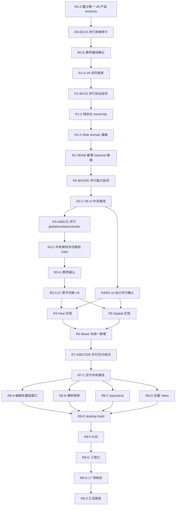

# V8 → V9 重建：AI 可执行并行任务索引

> 状态：默认工程真相已是 V9；R0–R7 engineering candidate；Wave 8a 机器侧已过；**R8-F 通过**；**R8-G 通过**；**R8-H 通过**；**R8-Z 已汇总**（机器 `engineering candidate`；体验 `art candidate`；`teacher decision: pending`）；已测通过的产品已合回 `main` 与仓库根目录；不得宣称 `accepted`
> 当前产品：仓库根目录 / `main`
> 唯一产品总纲：[`COURSEWARE_DEVELOPMENT_PLAN.md`](../../../COURSEWARE_DEVELOPMENT_PLAN.md)
> 共享执行合同：[`01_SHARED_EXECUTION_CONTRACT.md`](01_SHARED_EXECUTION_CONTRACT.md)
> 候选 V8 基线：`f27275658c6dfaa12f2ce35cd9368dcdebe99451`
> 当前 V9 供体：`475503498323` 及其历史；只读摘取，不整串重放
> 全量验证所有者：R8-A–H 分项执行，R8-Z 汇总；禁止把 `accepted` 写进任何子任务 HANDOFF

本目录是根计划 11.4 的唯一执行级任务包，不是第二份产品方案。旧 [`docs/tasks/v9-editor/`](../v9-editor/00_INDEX.md) 只作失败取证与供体说明，任何旧 `DONE`、绿色测试或 `engineering candidate` 都不能覆盖本任务包。

## 1. 执行目标

以成熟 V8 `App`、Workspace、store API 和全部教师可见能力为持续可用的产品主干，逐纵切迁入 Course Project V9、Published Course V2、Runtime API 2/3、Component API 4、Flow、Spatial、Mixed 与交付能力。默认 backend 只有在 V8 保护清单全部通过且教师确认后才能原子切换。

必须完整保留根计划 §0.4 的六组反馈：

1. 三类页面直接新建，新增 Slide 不得让旧内容消失；
2. 媒体库、声音库以及图片入画布后的命中、选择和属性编辑；
3. global owner 排序、逐 location 显隐与不漂移的教师控制器；
4. 强文本 Flow 与复用 Slide 元素内核的 Spatial；
5. 插入错开、画布双击、选区级局部格式；
6. 动画及所有尚未列出的 V8 可达能力零降级。

### 1.1 六点需求追踪

| ID | 硬需求 | 主实现 owner | 当阶段集成 | 最终 Gate |
|---|---|---|---|---|
| U1 | 三类新增；新增 Slide 不丢旧内容 | R2-A、R6-A/B | R6-Z | R8 场景 2、13、15 |
| U2 | 完整媒体/声音；图片可命中选中改属性 | R2-D、R3-B | R2-Z、R3-Z | R8 场景 7–8 |
| U3 | global 排序/逐页显隐；控制器八向且不漂移 | R3-A/C/D | R3-Z、R3-G | R8 场景 5–6、14 |
| U4 | 强文本 Flow；共享内核 Spatial；两者 global/media/component 可用 | R1-A、R4、R5 | R4-Z、R5-Z、R6-Z | R8 场景 11–12、14 |
| U5 | 插入错开、双击文字、选区级局部格式 | R2-B/C/D | R2-Z | R8 场景 1、3 |
| U6 | 动画及未发现 V8 能力零降级 | R0-B/C、R2-D | R2-Z、R3-G | R8 全量保护与场景 9 |

## 2. 每个 AI 的必读顺序

1. 根目录 `AGENTS.md`；
2. 根目录 `COURSEWARE_DEVELOPMENT_PLAN.md`，至少阅读 §0.4、§2、§6–§12；
3. 本索引；
4. [`01_SHARED_EXECUTION_CONTRACT.md`](01_SHARED_EXECUTION_CONTRACT.md)；
5. 若任务属于 R6/R7/R8：先读 [`artifacts/R6_R8_EXECUTION_PLAYBOOK.md`](artifacts/R6_R8_EXECUTION_PLAYBOOK.md)，再读阶段文档；
6. 自己领取的阶段文档和唯一任务 ID；
7. `PROJECT_COGNITION_INDEX.md` 中相关模块；
8. 当前产品 worktree 的实际源码、`package.json` 和现有 diff。

不得只凭任务文档中的历史文件名开始修改；先用 `rg --files`、`rg` 和 `git show` 确认当前事实。

## 3. 总依赖图



## 4. 波次与并行规则

| Wave | 可执行任务 | 并发规则 | 进入条件 |
|---|---|---|---|
| 0 | R0-A → R0-B/R0-C/R0-D → R0-G | A、G 串行；B/C/D 可并行 | 立即开始 |
| 1 | R1-A → R1-B/R1-C/R1-D → R1-Z | A、Z 串行；B/C/D 可并行 | R0-G 教师确认 |
| 2 | R2-A → R2-SEAM → R2-B/R2-C/R2-D/R2-E → R2-Z | A、SEAM、Z 串行；B–E 严格文件独占 | R1-Z 通过 |
| 3 | R3-A/R3-B/R3-C/R3-D → R3-Z → R3-G → R3-CUT；同时做 R4-DESIGN/R5-DESIGN | R3 A–D、两项设计可并行；R3 其余串行 | R2-Z 通过 |
| 4 | R4 与 R5 | 非热点 lane 可同时执行；R4-Z 与 R5-Z 必须由协调者串行持有壳层热点锁 | R3-CUT 完成；对应 UI 图已确认 |
| 5 | R6-A/R6-B/R6-C → R6-Z | A–C 可并行；Z 独占壳层热点 | R4-Z、R5-Z 均交付 |
| 6 | R7-A/R7-B/R7-C/R7-D/R7-E → R7-Z | A–E 可与 R6-Z 重叠（禁止碰壳层与 R6-Z 正在 HMR 的导出入口）；Z 串行 | A–E 不依赖 Mixed UI；Z 等 R6-Z 释锁 + A–E HANDOFF |
| 7 | R8-A/B/C/D | A 独占 Electron；B 写 ScenePanel；C/D 只跑机器命令、不写源码 | R7 Gate 已过；教师 2026-08-17 要求与两件补丁并行 |
| 8 | R8-E → R8-F → R8-G → R8-H → R8-Z | E 写 dist；F/G/H 互斥 Electron；Z 只汇总 | A–D HANDOFF；A 已释 Electron 槽 |

同一个 AI 一次只领取一个任务 ID。同一任务未 HANDOFF 前不得顺手开始相邻任务。

## 5. 阶段文档

| 阶段 | 文档 | 主要结果 | 初始状态 |
|---|---|---|---|
| R0 | [`02_R0_BASELINE_QUALIFICATION.md`](02_R0_BASELINE_QUALIFICATION.md) | 真实 V8 基线、唯一 worktree、能力清单、格式隔离 | `R0-G` 教师已确认主干；`R0-B` 账本补交 |
| R1 | [`03_R1_V9_PROTOCOL_KERNEL.md`](03_R1_V9_PROTOCOL_KERNEL.md) | V9/Published/Runtime/Component 纯协议内核 | `engineering candidate for this stage`；未宣称编辑器可用 |
| R2 | [`04_R2_SLIDE_PARITY.md`](04_R2_SLIDE_PARITY.md) | 同一 V8 UI 下的 V9-backed Slide 等价候选 | `engineering candidate for this stage`；选区粗体/动画预览窗口未覆盖 |
| R3 | [`05_R3_GLOBAL_MEDIA_CONTROLLER_AND_CUTOVER.md`](05_R3_GLOBAL_MEDIA_CONTROLLER_AND_CUTOVER.md) | global/surface、媒体声音、控制器与 V9 原子切换 | `engineering candidate for this stage`；默认已是 V9 |
| R4 | [`06_R4_FLOW_AUTHORING.md`](06_R4_FLOW_AUTHORING.md) | 强文本 Flow 作者态、Player 与导出基础 | `engineering candidate for this stage` |
| R5 | [`07_R5_SPATIAL_AUTHORING.md`](07_R5_SPATIAL_AUTHORING.md) | 共享元素内核的无限画布、镜头、路径与关系 | `engineering candidate for this stage` |
| R6 | [`08_R6_MIXED_AND_COURSE_STRUCTURE.md`](08_R6_MIXED_AND_COURSE_STRUCTURE.md) | 工程内主按钮+下拉、课树、跨 surface 路由 | `engineering candidate for this stage`；壳层锁已释放 |
| R7 | [`09_R7_DELIVERY_AND_MIGRATION.md`](09_R7_DELIVERY_AND_MIGRATION.md) | 整课 V2 Player、导出写文件、persistence 补洞 | Gate 通过；`R7E-R7Z-01` open（non-blocking） |
| R8 | [`10_R8_FINAL_FULL_GATE.md`](10_R8_FINAL_FULL_GATE.md) | 全量自动化、三视口、17 项体验、教师验收 | Wave 8a：A–H 已交；**R8-Z 已汇总**；教师 `pending`；不得 `accepted` |

## 6. 中央热点所有权

下列文件不得由并行 lane 直接修改；只由当前阶段的 `*-Z` 或明确写出的中央任务串行接线：

- `src/renderer/App.tsx`
- `src/renderer/main.tsx` 及未来等价唯一产品入口
- `src/renderer/store/editorStore.ts`
- `src/renderer/ui/Workspace.tsx`
- `src/renderer/ui/ScenePanel.tsx`
- `src/renderer/ui/RightSidebar.tsx`
- `src/renderer/ui/TopToolbar.tsx`
- `src/renderer/ui/NodesTab.tsx`
- `src/renderer/ui/PropertiesTab.tsx`
- `src/renderer/ui/ElementsTab.tsx`
- `src/renderer/ui/MediaTab.tsx`
- `src/renderer/styles/globals.css`

并行 lane 需要接线时，只提供窄导出、定向测试和 `INTEGRATION_REQUEST`。禁止为绕开热点所有权再建第二 App、第二 Workspace、第二侧栏或长期 controlled 分支。

## 7. 轻量验证总政策

R0–R7 的每个任务最多运行：

- 一条定向 Vitest 命令，最多包含两个最相关测试文件；
- 一次 `git diff --check -- <owned paths>`；
- 若任务是阶段集成者，可做一次只覆盖本阶段纵切的真实 UI 冒烟。

R0–R7 禁止全量 typecheck、全量 Vitest、build、完整 Electron/Playwright E2E、三视口视觉回归和截图基线重捕。`git diff --check` 只列本任务新建或授权改的文件，禁止扫整个 `ui/`、`course/`、`player/`、`export/`。R6–R8 的文件所有权与冒烟预算以 [`artifacts/R6_R8_EXECUTION_PLAYBOOK.md`](artifacts/R6_R8_EXECUTION_PLAYBOOK.md) 为准。完整禁令见共享合同。R8 子任务只跑自己那一条授权命令；不得顺手跑完整 `npm run verify`。

## 8. 任务派发模板

将下面文本与对应阶段文档交给执行 AI，并替换任务 ID：

```text
你只执行任务 <TASK_ID>。先完整阅读 AGENTS.md、COURSEWARE_DEVELOPMENT_PLAN.md、
docs/tasks/v8-to-v9-rebuild/00_INDEX.md、01_SHARED_EXECUTION_CONTRACT.md 和该阶段文档。
若任务属于 R6/R7/R8，先读 artifacts/R6_R8_EXECUTION_PLAYBOOK.md：补缺口，禁止重做已交付能力，禁止加码验证。
确认依赖 HANDOFF 已存在，并确认当前目录是登记的唯一产品 worktree。
只修改任务授权路径；中央热点只提交 INTEGRATION_REQUEST。
保留所有已有修改，不清理、不重置、不整串 cherry-pick donor。
R0–R7 只运行任务卡允许的一条定向 Vitest（最多两个文件）和 diff check。
R8-C/D/E/F 只运行本任务卡写出的那一条全量命令，禁止改成 `npm run verify`。
git diff --check 只列本任务实际改过的文件，禁止整目录。
最后严格按 HANDOFF 模板交付，不把 engineering candidate 写成 art candidate 或 accepted。
```

## 9. 状态与领取规则

- 只有协调者更新本索引中的阶段状态；lane 只在自己的 HANDOFF 中报告结果。
- `READY`：全部依赖已满足且文件 owner 空闲。
- `IN_PROGRESS`：已登记执行者与产品 worktree。
- `INTEGRATION_CANDIDATE`：lane 定向验证通过，尚未中央接线。
- `GATED`：需要教师确认或外部决定，AI 必须停止。
- `DONE`：阶段 Gate 实际通过；不能因文件存在或单测绿色自行标记。
- 任何产品决策冲突写 `DECISION_REQUEST`，不得在任务文档内自行改变总纲。

## 10. 协调者最小记录

协调者为每个任务记录：执行者、开始 SHA、产品 worktree、占用文件、HANDOFF 路径、集成请求、状态。推荐把交付追加到各阶段文档末尾或新增 `handoffs/<TASK_ID>.md`；不要把运行日志、截图二进制或生成目录提交进任务包。

执行期使用以下现成模板：

- [`artifacts/V8_CAPABILITY_LEDGER.md`](artifacts/V8_CAPABILITY_LEDGER.md)：R0 建账，R2/R3/R8 更新；
- [`artifacts/INTEGRATION_LEDGER.md`](artifacts/INTEGRATION_LEDGER.md)：所有 blocking 请求的唯一状态表；
- [`artifacts/FINAL_GATE_REPORT.md`](artifacts/FINAL_GATE_REPORT.md)：只由 R8-FINAL 填写。
- [`artifacts/R0_C_DONOR_MATRIX.md`](artifacts/R0_C_DONOR_MATRIX.md)：R0-C 已交付的真实路径与供体摘取表。
- [`artifacts/R6_R8_EXECUTION_PLAYBOOK.md`](artifacts/R6_R8_EXECUTION_PLAYBOOK.md)：R6 起的已有能力、禁止重做、冻结命令/testid、验证预算。

| 任务 | 执行者 | 产品 worktree | HANDOFF | 状态 |
|---|---|---|---|---|
| R0-A | 协调者 | `HTML课件编辑器-v8-to-v9-rebuild` @ `f272756` | [`handoffs/R0-A.md`](handoffs/R0-A.md) | `lane_candidate` |
| R0-B | [R0-B 能力审计](e4d32ddf-7e11-4df7-974a-a06318b4dd49) | 只读 UI | [`handoffs/R0-B.md`](handoffs/R0-B.md) | `lane_candidate` |
| R0-C | [R0-C 供体矩阵](7b0560fd-c387-4870-87cd-3130e3b1af5a) | 只读 | [`handoffs/R0-C.md`](handoffs/R0-C.md) | `lane_candidate` |
| R0-D | [R0-D 格式隔离](73f9e5dc-207b-4295-ac58-714270cc940c) | 产品 worktree 窄 host/project 文件 | [`handoffs/R0-D.md`](handoffs/R0-D.md) | `lane_candidate` |
| R0-G | 协调者 | 只写 Gate 记录 | [`handoffs/R0-G.md`](handoffs/R0-G.md) | 教师已确认主干 |
| R1-A | [R1-A 协议骨架](abaade51-ef1b-45e6-9888-d6ad5be0a833) | 产品 worktree `src/shared` 协议文件 | [`handoffs/R1-A.md`](handoffs/R1-A.md) | `lane_candidate` |
| R1-B | [R1-B Archive迁移](a1bf5575-6192-427a-bfe0-471b9bac6a4c) | 新建 `courseProjectArchive*` | [`handoffs/R1-B.md`](handoffs/R1-B.md) | `lane_candidate` |
| R1-C | [R1-C Published producer](ff7fdc6b-5bda-4591-aaef-0c8e006c47a9) | 新建 `export/course/*` | [`handoffs/R1-C.md`](handoffs/R1-C.md) | `lane_candidate` |
| R1-D | [R1-D Runtime合同](611f7a8a-c53b-4c15-8d92-21b31d86fb59) | 仅测试断言；生产协议零 diff | [`handoffs/R1-D.md`](handoffs/R1-D.md) | `lane_candidate` |
| R1-Z | [R1-Z 协议round-trip](24bd53a4-ca7f-4a77-9637-280c4cbd0dc7) | 仅新建 round-trip 测试 | [`handoffs/R1-Z.md`](handoffs/R1-Z.md) | `lane_candidate` |
| R2-A | [R2-A Slide domain](73474f08-a201-4e43-ac39-677e0abd47b8) | `src/renderer/course` Slide domain | [`handoffs/R2-A.md`](handoffs/R2-A.md) | `lane_candidate` |
| R2-SEAM | [R2-SEAM 最薄接缝](a8bb0fe7-8bed-40fe-8bf2-44792d24631a) | `editorStore` + `slideBackendPort` | [`handoffs/R2-SEAM.md`](handoffs/R2-SEAM.md) | `lane_candidate` |
| R2-B | [R2-B 命中变换](bd4b349a-eb19-4e57-aa0d-81b790a6a498) | `workspaceSlideAuthoring` + Phaser 窄扩 | [`handoffs/R2-B.md`](handoffs/R2-B.md) | `lane_candidate` |
| R2-C | [R2-C 文字事务](d819f184-4fa1-4e64-a66e-4b7adf113603) | `v9SlideContentEdit` | [`handoffs/R2-C.md`](handoffs/R2-C.md) | `lane_candidate` |
| R2-D | [R2-D 内容命令](da2c1a1f-4851-4d08-9eec-8a820b92df84) | `v9SlideContentCommands` | [`handoffs/R2-D.md`](handoffs/R2-D.md) | `lane_candidate` |
| R2-E | [R2-E 图层动作](52e7c174-ed7f-4179-9021-50f8d7343c9b) | action/clipboard/interaction | [`handoffs/R2-E.md`](handoffs/R2-E.md) | `lane_candidate` |
| R2-Z | [R2-Z Slide UI接线](74f8f355-4922-484b-9a77-4bcfc9a3f132) | App / store / Workspace / 侧栏热点 | [`handoffs/R2-Z.md`](handoffs/R2-Z.md) | `lane_candidate` |
| R2-GATE | 协调者 | 只写 Gate 记录 | [`handoffs/R2-GATE.md`](handoffs/R2-GATE.md) | Wave 3 已过；选区粗体/动画预览仍 integrated |
| R3-A | [R3-A global图层命令](dfcc292f-e884-4732-bf54-5096f3da0aed) | `globalLayerCommands` / `effectiveLayerCommands` | [`handoffs/R3-A.md`](handoffs/R3-A.md) | `lane_candidate` |
| R3-B | [R3-B 媒体声音命令](4670f031-d519-41ed-861c-801f430fe86d) | `v9MediaAudioCommands` + asset 窄扩 | [`handoffs/R3-B.md`](handoffs/R3-B.md) | `lane_candidate` |
| R3-C | [R3-C 控制器几何会话](37e0ef9b-85c2-4ff4-8ff6-a5ec2a7266c0) | teacher controller 几何/会话 | [`handoffs/R3-C.md`](handoffs/R3-C.md) | `lane_candidate` |
| R3-D | [R3-D 有效图层投影](6a1efa29-8bd5-45bc-af40-d8c07a1faa6a) | effective layer 投影 / authoring scope | [`handoffs/R3-D.md`](handoffs/R3-D.md) | `lane_candidate` |
| R3-Z | [R3-Z 中央接线](98440e20-4324-4fc1-a5d5-676633bec511) | App / store / Workspace / Nodes / Properties / MediaTab | [`handoffs/R3-Z.md`](handoffs/R3-Z.md) | `engineering candidate for this stage` |
| R3-SMOKE | [R3 真实窗口冒烟](b0285cc0-d844-43b8-b7fc-1f2ff22c7df4) | 专用 Electron candidate 会话 | [`handoffs/R3-SMOKE.md`](handoffs/R3-SMOKE.md) | 窗口纵切做成 |
| R3-G | 协调者 | 只写 Gate 记录 | [`handoffs/R3-G.md`](handoffs/R3-G.md) | 已通过；允许 CUT |
| R3-GATE | 协调者 | 只写 Gate 记录 | [`handoffs/R3-GATE.md`](handoffs/R3-GATE.md) | 八条 verified；CUT 已解锁 |
| R3-CUT | [R3-CUT 默认切V9](44f0dc4d-81b1-412e-b9ca-d81c2ad68572) | 默认新建/打开/保存/恢复切 V9 | [`handoffs/R3-CUT.md`](handoffs/R3-CUT.md) | `engineering candidate for this stage` |
| R4-DESIGN | [R4-DESIGN Flow UI合同](2c644b29-e35b-4cb6-ad94-2208b08b99be) | 只写设计合同，不改产品代码 | [`handoffs/R4-DESIGN.md`](handoffs/R4-DESIGN.md) | `lane_candidate`；coordinator-proposed freeze |
| R4-A | [R4-A Flow文档命令](805f008b-9032-467a-93c4-eb83cbe4b8ce) | `flowEditorCommands/Slice/View` | [`handoffs/R4-A.md`](handoffs/R4-A.md) | `lane_candidate` |
| R4-B | [R4-B Flow稿纸编辑](283738cb-983f-43a3-b5b7-b3ff69df5515) | `FlowWorkspace` + text bridge | [`handoffs/R4-B.md`](handoffs/R4-B.md) | `lane_candidate` |
| R4-C | [R4-C Flow浮层适配](fcae932a-4c5e-432b-9f90-18f0e573a12a) | `flowSharedAuthoringAdapters` | [`handoffs/R4-C.md`](handoffs/R4-C.md) | `lane_candidate` |
| R4-D | [R4-D Flow Player导出](958b6f5f-9d39-43fe-816e-f964b1db5e4e) | `FlowSurfaceHost` / TOC / docx helper | [`handoffs/R4-D.md`](handoffs/R4-D.md) | `lane_candidate` |
| R4-Z | [R4-Z Flow中央接线](c7be4f23-81c0-441e-965d-f0e6cb04303f) | App / store / Workspace / ScenePanel / 右栏窄接线 | [`handoffs/R4-Z.md`](handoffs/R4-Z.md) | `engineering candidate for this stage`；壳层锁已释放 |
| R4-GATE | 协调者 | 只写 Gate 记录 | [`handoffs/R4-GATE.md`](handoffs/R4-GATE.md) | 通过；允许 R6-Z |
| R5-DESIGN | [R5-DESIGN Spatial UI合同](0b7d34a8-465e-43ab-a3c4-9bc5597aa4c8) | 只写设计合同，不改产品代码 | [`handoffs/R5-DESIGN.md`](handoffs/R5-DESIGN.md) | `lane_candidate`；coordinator-proposed freeze |
| R5-A | [R5-A Spatial世界镜头](ac76dca1-bb05-4683-8e88-920db0b5eeb5) | `spatialEditorCommands/View` + camera | [`handoffs/R5-A.md`](handoffs/R5-A.md) | `lane_candidate` |
| R5-B | [R5-B Spatial世界适配](93dd3a2d-2096-4800-9c01-524c7a1e1603) | `spatialWorldAuthoring` + world-to-screen | [`handoffs/R5-B.md`](handoffs/R5-B.md) | `lane_candidate` |
| R5-C | [R5-C path关系语义缩放](ea0ae964-a508-418e-a751-165dde4cd53e) | `spatialPathCommands` + 轻量专用控件 | [`handoffs/R5-C.md`](handoffs/R5-C.md) | `lane_candidate` |
| R5-D | [R5-D Spatial Player宿主](183fadf6-f238-4703-929a-3ac9f6b9a98a) | `SpatialSurfaceHost` / `spatialModel` | [`handoffs/R5-D.md`](handoffs/R5-D.md) | `lane_candidate` |
| R5-Z | [R5-Z Spatial中央接线](12aac0d4-a7d8-4e37-95a4-178c959b4d1b) | App / store / Workspace / ScenePanel / TopToolbar | [`handoffs/R5-Z.md`](handoffs/R5-Z.md) | `engineering candidate for this stage` |
| R5-GATE | 协调者 | 只写 Gate 记录 | [`handoffs/R5-GATE.md`](handoffs/R5-GATE.md) | 通过；允许 R4-Z |
| R6-A | [R6-A 课程新增命令](2d547197-0710-41ba-80d4-aee8179df629) | `courseLocationCommands` / `courseEditorLayout` | [`handoffs/R6-A.md`](handoffs/R6-A.md) | `lane_candidate` |
| R6-B | [R6-B 课树投影](32f4530b-e609-4c06-bba3-1711e0f2844f) | `courseTreeView.ts` | [`handoffs/R6-B.md`](handoffs/R6-B.md) | `lane_candidate` |
| R6-C | [R6-C 跨页动作路由](9b684de0-3d92-4815-ada5-fa6e2b302256) | `editorActionRouting` / session | [`handoffs/R6-C.md`](handoffs/R6-C.md) | `lane_candidate` |
| R6-Z | [R6-Z Mixed中央接线](2adc1048-ef8f-4502-89ea-b8b576c3f23d) | App / store / ScenePanel / Workspace | [`handoffs/R6-Z.md`](handoffs/R6-Z.md) | `engineering candidate for this stage`；壳层锁已释放 |
| R6-GATE | 协调者 | 只写 Gate 记录 | [`handoffs/R6-GATE.md`](handoffs/R6-GATE.md) | 通过；壳层锁已释放 |
| R7-A | [R7-A persistence补洞](fec19934-5fbf-457f-866f-ef53c2e40976) | recovery 读写仅 V9 | [`handoffs/R7-A.md`](handoffs/R7-A.md) | `lane_candidate` |
| R7-B | [R7-B 课程Player组装](7b9fb5f4-7405-48e6-9d1e-31101375293e) | CoursePlayer / Mixed 导航 | [`handoffs/R7-B.md`](handoffs/R7-B.md) | `lane_candidate` |
| R7-C | [R7-C V2 HTML网页包](bbb0c1f5-4f35-4c2a-b8df-83d25dc0520d) | `buildCoursePackages.ts` | [`handoffs/R7-C.md`](handoffs/R7-C.md) | `lane_candidate` |
| R7-D | [R7-D PPTX打印DOCX入口](77c43707-b4b8-48c9-a5c6-bdbe232bfd37) | PPTX/PDF/DOCX producers | [`handoffs/R7-D.md`](handoffs/R7-D.md) | `lane_candidate` |
| R7-E | [R7-E Runtime DOM桥](0dd8aaf9-16fb-4eb1-a82d-aefff15440cf) | `SurfaceRuntimeAuthoringBridge` | [`handoffs/R7-E.md`](handoffs/R7-E.md) | `lane_candidate` |
| R7-Z | [R7-Z 交付中央接线](08d3720c-cbdf-41cd-9ef2-25d43ebd12c2) | App / Workspace / 导出菜单 | [`handoffs/R7-Z.md`](handoffs/R7-Z.md) | `engineering candidate for this stage`；壳层锁已释放 |
| R7-GATE | 协调者 | 只写 Gate 记录 | [`handoffs/R7-GATE.md`](handoffs/R7-GATE.md) | 交付通过；Wave 8a 已开 |
| R8-A | [R8-A 编辑态重挂冒烟](07c0cd6b-8d74-4736-b90f-57cc68c51168) | 只读产品源码 + `output/r8-a-smoke/` | [`handoffs/R8-A.md`](handoffs/R8-A.md) | `blocked`；宿主未 remount，隔离 Player 仍重建 |
| R8-A-RECHECK | [R8-A-RECHECK 编辑态窗口复测](dcae8481-5d73-4072-aece-5d57a7c414ee) | 只读 + `output/r8-a-recheck/` | [`handoffs/R8-A-RECHECK.md`](handoffs/R8-A-RECHECK.md) | `lane_candidate`；`PRE-R8-01` verified；Electron 已释放 |
| R8-FIX-SHELL-WS | [R8-FIX-SHELL-WS Workspace类型](90ad9003-8307-43a6-a12b-220c5077dd79) | `Workspace.tsx` 类型 | [`handoffs/R8-FIX-SHELL-WS.md`](handoffs/R8-FIX-SHELL-WS.md) | `lane_candidate`；Workspace.tsx 0 TS；未改 preview 依赖 |
| R8-FIX-PREVIEW | [R8-FIX-PREVIEW 隔离Player重建](38537a34-2e26-4dd7-864e-e4a55a076cab) | `Workspace.tsx` preview 依赖 | [`handoffs/R8-FIX-PREVIEW.md`](handoffs/R8-FIX-PREVIEW.md) | `lane_candidate`；`PRE-R8-01` verified |
| R8-B | [R8-B 课树拖排恢复](df34bdc3-e531-41c7-a5eb-d0d527292c01) | `ScenePanel.tsx` + 薄 `reorderCourseSurfaces` | [`handoffs/R8-B.md`](handoffs/R8-B.md) | `lane_candidate`；`PRE-R8-02` verified |
| R8-C | [R8-C typecheck](12d5b989-8c3d-40cf-aac0-40aacecd10c3) | 不写源码 | [`handoffs/R8-C.md`](handoffs/R8-C.md) | 初跑 `blocked`；[`R8-C-RECHECK`](handoffs/R8-C-RECHECK.md) 全链绿；`R8C-TSC-01` verified |
| R8-D | [R8-D 全量 Vitest](7f54ca27-1ce5-4c2c-8d36-f3a572d26836) | 不写源码 | [`handoffs/R8-D.md`](handoffs/R8-D.md) | 初跑 `blocked`；[`R8-D-RECHECK-2`](handoffs/R8-D-RECHECK-2.md) 189/1118 全绿 |
| R8-FIX-CAP | [R8-FIX-CAP 刷新能力清单](4b755647-081d-497c-8696-47ec736ab074) | `artifacts/ai-capabilities/` | [`handoffs/R8-FIX-CAP.md`](handoffs/R8-FIX-CAP.md) | `lane_candidate`；`R8C-CAP-01` verified |
| R8-FIX-CUT-TESTS | [R8-FIX-CUT-TESTS 跟切V9](57a02449-78ff-49d6-b003-f790c6d5d901) | 仅列出的 v9*/recovery 测试 | [`handoffs/R8-FIX-CUT-TESTS.md`](handoffs/R8-FIX-CUT-TESTS.md) | `lane_candidate`；`R8D-CUT-01` verified |
| R8-FIX-FLOW-TSC | [R8-FIX-FLOW-TSC Flow类型](eddf7318-cc90-4fc3-aed1-f5732885810c) | Flow player/course/UI | [`handoffs/R8-FIX-FLOW-TSC.md`](handoffs/R8-FIX-FLOW-TSC.md) | `lane_candidate`；授权路径 0 TS |
| R8-FIX-TSC-REST | [R8-FIX-TSC-REST 外围类型](14eee1d8-224e-4f7c-9ad6-63325ae963fb) | Spatial/export hosts | [`handoffs/R8-FIX-TSC-REST.md`](handoffs/R8-FIX-TSC-REST.md) | `lane_candidate`；授权文件 0 TS |
| R8-FIX-TSC-TREE | [R8-FIX-TSC-TREE 课树测试类型](1b4042f9-48f1-473e-a913-c033a7f252b9) | `courseTreeView.test.ts` | [`handoffs/R8-FIX-TSC-TREE.md`](handoffs/R8-FIX-TSC-TREE.md) | `lane_candidate`；授权文件 0 TS |
| R8-FIX-TSC-TABS | [R8-FIX-TSC-TABS 属性节点类型](3d504c7c-33f9-4605-ae5f-6a3f0e1bdcd4) | PropertiesTab / NodesTab | [`handoffs/R8-FIX-TSC-TABS.md`](handoffs/R8-FIX-TSC-TABS.md) | `lane_candidate`；授权文件 0 TS |
| R8-FIX-TSC-V9TEST | [R8-FIX-TSC-V9TEST 切测类型](7f1b5d11-2cd0-4555-9944-000f90bed86f) | `v9Slide*` 测试 TS 余量 | [`handoffs/R8-FIX-TSC-V9TEST.md`](handoffs/R8-FIX-TSC-V9TEST.md) | `lane_candidate`；授权测试 0 TS；CUT 默认仍是 V9 |
| R8-FIX-TSC-PREVIEW-TEST | [R8-FIX-TSC-PREVIEW-TEST 指纹单测](472f4488-20f8-4da7-9475-b5ca30e54418) | `slidePreviewRebuildKey.test.ts` | [`handoffs/R8-FIX-TSC-PREVIEW-TEST.md`](handoffs/R8-FIX-TSC-PREVIEW-TEST.md) | `lane_candidate`；该测试 0 TS；4 tests passed |
| R8-FIX-R6-TESTID | [R8-FIX-R6-TESTID 新增按钮](d35fb89c-fb38-483a-8320-795cd439a07b) | AddCourseContentMenu / flow 测试 | [`handoffs/R8-FIX-R6-TESTID.md`](handoffs/R8-FIX-R6-TESTID.md) | `lane_candidate`；`R8D-R6-01` verified |
| R8-FIX-STORE | [R8-FIX-STORE V9投影测试](87a5d616-488e-4fbf-9848-690899e3d0f2) | editorStore 投影 + 媒体/global 测试 | [`handoffs/R8-FIX-STORE.md`](handoffs/R8-FIX-STORE.md) | `lane_candidate`；优先 1–6 全绿（40 tests） |
| R8-FIX-SHELL | [R8-FIX-SHELL editorStore类型](6392e449-3d5a-4adb-8b32-0afa49e1405f) | `editorStore.ts` 类型 | [`handoffs/R8-FIX-SHELL.md`](handoffs/R8-FIX-SHELL.md) | `lane_candidate`；editorStore 0 TS；优先 6 仍绿 |
| R8-C-RECHECK | [R8-C-RECHECK 全链typecheck](9c4977be-3606-4f44-ade5-4df2ae99f04a) | 不写源码 | [`handoffs/R8-C-RECHECK.md`](handoffs/R8-C-RECHECK.md) | `lane_candidate`；capabilities + typecheck 全链 0；`R8C-TSC-01` verified |
| R8-FIX-STORE-REST | [R8-FIX-STORE-REST 余力红测](c1d3adb2-df66-4d38-954b-0f4b0f983b4a) | 组件包/命名状态/history/缩略图 | [`handoffs/R8-FIX-STORE-REST.md`](handoffs/R8-FIX-STORE-REST.md) | `lane_candidate`；6 目标全绿；顺手 3 文件也绿 |
| R8-C-RECHECK-2 | [R8-C-RECHECK-2 store后typecheck](828c31b2-9acd-4cca-8142-350b88b8e8f8) | 不写源码 | [`handoffs/R8-C-RECHECK-2.md`](handoffs/R8-C-RECHECK-2.md) | `lane_candidate`；STORE-REST 后 typecheck 全链 0；`R8C-TSC-01` 保持 verified |
| R8-D-RECHECK | [R8-D-RECHECK 全量Vitest](ca297718-52bf-45cc-b3d0-25f836fda70c) | 不写源码 | [`handoffs/R8-D-RECHECK.md`](handoffs/R8-D-RECHECK.md) | `blocked`；189 文件 / 1118 测试，2 文件 / 2 测试红 |
| R8-FIX-STORE-LASTSCENE | [R8-FIX-STORE-LASTSCENE 末场景早退](8031e444-c2d6-4c14-831a-d45f23fc7c0e) | `deleteScene` 早退 | [`handoffs/R8-FIX-STORE-LASTSCENE.md`](handoffs/R8-FIX-STORE-LASTSCENE.md) | `lane_candidate`；`editorStore.test.ts` 62 passed |
| R8-FIX-AUTHORING-MODAL | [R8-FIX-AUTHORING-MODAL 导入对话框](a2f1dfc5-0a79-4d93-9fc8-661ed37b5ee3) | authoring runner 显式导入 | [`handoffs/R8-FIX-AUTHORING-MODAL.md`](handoffs/R8-FIX-AUTHORING-MODAL.md) | `lane_candidate`；该文件 3/3 绿 |
| R8-C-RECHECK-3 | [R8-C-RECHECK-3 产品后typecheck](e7df3c1b-6d4c-421c-be1d-9c580161d9ff) | 不写源码 | [`handoffs/R8-C-RECHECK-3.md`](handoffs/R8-C-RECHECK-3.md) | `lane_candidate`；LASTSCENE+AUTHORING 后 typecheck 全链 0；`R8C-TSC-01` 保持 verified |
| R8-D-RECHECK-2 | [R8-D-RECHECK-2 全量Vitest](7ed08d58-8fd2-4159-9e93-54b6cdae79dc) | 不写源码 | [`handoffs/R8-D-RECHECK-2.md`](handoffs/R8-D-RECHECK-2.md) | `lane_candidate`；189 文件 / 1118 测试全绿 |
| R8-E | [R8-E desktop build](6dd823b7-db88-48bc-a570-8c058a860b6c) | 不写源码；`dist-*` 构建产物未 commit | [`handoffs/R8-E.md`](handoffs/R8-E.md) | `lane_candidate`；`build:desktop` exit 0；player/renderer/electron 三段均到达 |
| R8-F | [R8-F 现有E2E](ba99e19b-a40e-4580-a4cf-c69dd1ba94af) | 不写源码 | [`handoffs/R8-F.md`](handoffs/R8-F.md) | **通过**；27 条均有绿证据（RECHECK-13 前 23 + [`R8-F-LAST4`](handoffs/R8-F-LAST4.md) 后 4） |
| R8-FIX-E2E | [R8-FIX-E2E 跟切试运行与图层](aa664e76-a9f6-45db-a36b-2e82c85442bc) | 仅两个现有 e2e spec | [`handoffs/R8-FIX-E2E.md`](handoffs/R8-FIX-E2E.md) | `lane_candidate`；目录 UI 1 绿；简洁模式/CoursePlayer/流程 9 共 3 绿 |
| R8-F-RECHECK | [R8-F-RECHECK 全量e2e](50bbdbd5-1bc0-4bfc-9cfc-188ac43f090e) | 不写源码 | [`handoffs/R8-F-RECHECK.md`](handoffs/R8-F-RECHECK.md) | `blocked`；1 failed / 20 did not run / 6 passed；FIX-E2E 原失败全量仍绿 |
| R8-FIX-SELECT-TAB | [R8-FIX-SELECT-TAB 点选切属性](af6b3d94-ae07-43eb-b7bc-67e2aaafc965) | 画布 selectLayers 切 properties | [`handoffs/R8-FIX-SELECT-TAB.md`](handoffs/R8-FIX-SELECT-TAB.md) | `lane_candidate`；A「Player 与编辑交互层」1 绿 |
| R8-FIX-SCENE-LAYER | [R8-FIX-SCENE-LAYER 删场景与图层拖排](ae053031-c16d-4b86-b737-d564cee08468) | ScenePanel 删除场景；NodesTab 同 owner 排序 | [`handoffs/R8-FIX-SCENE-LAYER.md`](handoffs/R8-FIX-SCENE-LAYER.md) | `lane_candidate`；流程 1 删除场景 + 流程 3 图层拖排 2 绿 |
| R8-F-RECHECK-2 | [R8-F-RECHECK-2 全量e2e](e7e336a6-5566-44f1-9bf0-2b10c79a89f2) | 不写源码 | [`handoffs/R8-F-RECHECK-2.md`](handoffs/R8-F-RECHECK-2.md) | `blocked`；1 failed / 19 did not run / 7 passed；SELECT-TAB 交互层全量绿；新红「统一画布」V8 导入对话框 |
| R8-FIX-E2E-IMPORT | [R8-FIX-E2E-IMPORT 显式导入跟切](bfa9ce8e-42da-4908-8206-0f3a7e8c91ec) | 仅 editor.spec 打开 V8 后确认导入 | [`handoffs/R8-FIX-E2E-IMPORT.md`](handoffs/R8-FIX-E2E-IMPORT.md) | `lane_candidate`；「统一画布」1 绿 |
| R8-F-RECHECK-3 | [R8-F-RECHECK-3 全量e2e](b163417d-4eb1-46fd-9192-b68d72304085) | 不写源码 | [`handoffs/R8-F-RECHECK-3.md`](handoffs/R8-F-RECHECK-3.md) | `blocked`；10 passed / 1 failed / 16 did not run；「统一画布」全量绿；新红「文字编辑事务」undo |
| R8-FIX-TEXT-TXN | [R8-FIX-TEXT-TXN 换source先commit](c2c660f8-94e5-4c37-9cbc-722be1dfd9cf) | V9 beginTextEdit 换 source 先提交草稿 | [`handoffs/R8-FIX-TEXT-TXN.md`](handoffs/R8-FIX-TEXT-TXN.md) | `lane_candidate`；「文字编辑事务」1 绿；`editorStore.test.ts` 63 passed |
| R8-F-RECHECK-4 | [R8-F-RECHECK-4 全量e2e](c5d7e9b6-4cbe-4ed8-97ee-3953237765fa) | 不写源码 | [`handoffs/R8-F-RECHECK-4.md`](handoffs/R8-F-RECHECK-4.md) | `blocked`；13 passed / 1 failed / 13 did not run；「文字编辑事务」全量绿；新红「流程 4」组件画布双击 |
| R8-FIX-COMP-DBLCLICK | [R8-FIX-COMP-DBLCLICK 组件画布双击](d1aae222-024e-454b-ba09-13bec97506f7) | Workspace V9 双击落到组件/Runtime overlay | [`handoffs/R8-FIX-COMP-DBLCLICK.md`](handoffs/R8-FIX-COMP-DBLCLICK.md) | `lane_candidate`；双击已落地；整条「流程 4」由 XFORM 定向绿 |
| R8-FIX-COMP-XFORM | [R8-FIX-COMP-XFORM 组件画布变换](cb1ecc5f-b88a-4690-9bfb-0ef9121142f9) | nativeFrames + transform 收录场景 component | [`handoffs/R8-FIX-COMP-XFORM.md`](handoffs/R8-FIX-COMP-XFORM.md) | `lane_candidate`；「流程 4」1 绿；`v9SlideDomain.test.ts` 7 passed |
| R8-F-RECHECK-5 | [R8-F-RECHECK-5 全量e2e](7f88ea76-b2a6-4a7d-ac2b-67f28285a278) | 不写源码 | [`handoffs/R8-F-RECHECK-5.md`](handoffs/R8-F-RECHECK-5.md) | `blocked`；14 passed / 1 failed / 12 did not run；「流程 4」全量绿；新红「V8 全局层」 |
| R8-FIX-GLOBAL-TEXT | [R8-FIX-GLOBAL-TEXT 全局原生文字](b9804136-7a43-4791-b02b-a2e07cc20b8d) | V9 全局 text 草稿投影与提交 | [`handoffs/R8-FIX-GLOBAL-TEXT.md`](handoffs/R8-FIX-GLOBAL-TEXT.md) | `lane_candidate`；:1739 已过；整条由 LAYER-POS 定向绿 |
| R8-FIX-GLOBAL-LAYER-POS | [R8-FIX-GLOBAL-LAYER-POS 图层位置](c5439ea7-96d0-4d64-8f78-f8c5464f6c89) | CandidateGlobalLayerSettings 恢复 V8 图层位置/场景可见范围 | [`handoffs/R8-FIX-GLOBAL-LAYER-POS.md`](handoffs/R8-FIX-GLOBAL-LAYER-POS.md) | `lane_candidate`；「V8 全局层」1 绿 |
| R8-F-RECHECK-6 | [R8-F-RECHECK-6 全量e2e](d9f7cff1-3947-4efd-88cf-a660a482ea16) | 不写源码 | [`handoffs/R8-F-RECHECK-6.md`](handoffs/R8-F-RECHECK-6.md) | `blocked`；15 passed / 1 failed / 11 did not run；「V8 全局层」全量绿；新红「Component API 4 全局组件」 |
| R8-FIX-GLOBAL-SCENE-LABEL | [R8-FIX-GLOBAL-SCENE-LABEL 场景勾选名](ab8cf9d3-4e2c-4e98-a589-1ba833bb3055) | CandidateGlobalLayerSettings 勾选框对齐 scene.name | [`handoffs/R8-FIX-GLOBAL-SCENE-LABEL.md`](handoffs/R8-FIX-GLOBAL-SCENE-LABEL.md) | `lane_candidate`；:1849 已过；整条由 PREVIEW-COMP 定向绿 |
| R8-FIX-SLIDE-PREVIEW-COMP | [R8-FIX-SLIDE-PREVIEW-COMP 预览组件可见](fb202458-bf72-4b4b-b2e0-361e13799e99) | SlidePublishedAdapter 渲染 component/runtime 可见后备 | [`handoffs/R8-FIX-SLIDE-PREVIEW-COMP.md`](handoffs/R8-FIX-SLIDE-PREVIEW-COMP.md) | `lane_candidate`；「Component API 4 全局组件」1 绿 |
| R8-F-RECHECK-7 | [R8-F-RECHECK-7 全量e2e](33a9b635-2c64-4507-a986-caf62848f355) | 不写源码 | [`handoffs/R8-F-RECHECK-7.md`](handoffs/R8-F-RECHECK-7.md) | `blocked`；16 passed / 1 failed / 10 did not run；「Component API 4 全局组件」全量绿；新红「Runtime API 2 / Component API 4 导出」 |
| R8-FIX-E2E-EXPORT | [R8-FIX-E2E-EXPORT 导出夹具V9](ae05145d-d66f-4f58-a453-6cae3be6a388) | 导出条跟切 V9 夹具；纯 Slide PPTX 走 buildPptx | [`handoffs/R8-FIX-E2E-EXPORT.md`](handoffs/R8-FIX-E2E-EXPORT.md) | `lane_candidate`；首派 resource_exhausted；定向导出条 53.8s 绿 |
| R8-F-RECHECK-8 | [R8-F-RECHECK-8 全量e2e](ede2127a-c1d9-4c69-84b1-50604d66eb03) | 不写源码 | [`handoffs/R8-F-RECHECK-8.md`](handoffs/R8-F-RECHECK-8.md) | `blocked`；2 passed / 2 failed / 23 did not run；首红「目录 UI」PPTX 缺「静态导出提示」；导出条未跑，勿标 `R8F-RUNTIME-EXPORT-01` verified |
| R8-FIX-CATALOG-PPTX | R8-FIX-CATALOG-PPTX 目录PPTX提示 | 快照成功时仍写「静态导出提示」 | [`handoffs/R8-FIX-CATALOG-PPTX.md`](handoffs/R8-FIX-CATALOG-PPTX.md) | `lane_candidate`；「目录 UI」1 绿（3.0m） |
| R8-F-RECHECK-9 | [R8-F-RECHECK-9 全量e2e](db342083-eff1-49da-a0c6-0170ca61e3ee) | 不写源码 | [`handoffs/R8-F-RECHECK-9.md`](handoffs/R8-F-RECHECK-9.md) | `blocked`；18 passed / 1 failed / 8 did not run；目录 UI 与导出条全量绿；新红「流程 5」Presenter `__H5_LESSON_PLAYER__` 为 null |
| R8-FIX-PRESENTER-HTML | R8-FIX-PRESENTER-HTML 离线翻页 | Published Course 挂 Presenter 桥与 escape；发布文字带作者字号 | [`handoffs/R8-FIX-PRESENTER-HTML.md`](handoffs/R8-FIX-PRESENTER-HTML.md) | `lane_candidate`；「流程 5」定向 1 绿（1.1m） |
| R8-F-RECHECK-10 | [R8-F-RECHECK-10 全量e2e](39a06b1c-62ef-4d3d-a370-1d0a3679ff1e) | 不写源码 | [`handoffs/R8-F-RECHECK-10.md`](handoffs/R8-F-RECHECK-10.md) | `blocked`；20 passed / 1 failed / 6 did not run；流程 5 全量绿；新红「图片导入」东向拉伸宽高比 |
| R8-FIX-IMAGE-ASPECT | R8-FIX-IMAGE-ASPECT 图片拉伸锁比 | V9 overlay 东向拉伸读 preserveAspectRatio | [`handoffs/R8-FIX-IMAGE-ASPECT.md`](handoffs/R8-FIX-IMAGE-ASPECT.md) | `lane_candidate`；RECHECK-12 全量绿；`R8F-IMAGE-ASPECT-01` verified |
| R8-F-RECHECK-11 | [R8-F-RECHECK-11 全量e2e](5f31e1cc-5256-428f-ab5e-fb3f5e7148b0) | 不写源码 | [`handoffs/R8-F-RECHECK-11.md`](handoffs/R8-F-RECHECK-11.md) | `blocked`；3 passed / 1 failed / 23 did not run；目录 UI 仍绿；图片导入未跑；新红「简洁模式」淡入预览 alpha |
| R8-FIX-SIMPLE-FADE | R8-FIX-SIMPLE-FADE 淡入不自动预览 | V9 选淡入不再自动播；预览按钮才播 | [`handoffs/R8-FIX-SIMPLE-FADE.md`](handoffs/R8-FIX-SIMPLE-FADE.md) | `lane_candidate`；RECHECK-12 全量绿；`R8F-SIMPLE-FADE-01` verified |
| R8-F-RECHECK-12 | [R8-F-RECHECK-12 全量e2e](96506038-ba3d-4fd8-8150-2025d7a5e968) | 不写源码 | [`handoffs/R8-F-RECHECK-12.md`](handoffs/R8-F-RECHECK-12.md) | `blocked`；22 passed / 2 failed / 3 did not run；简洁模式与图片导入全量绿；新红「流程 8」`.form-textarea` |
| R8-FIX-TEXT-PROPS | [R8-FIX-TEXT-PROPS 局部格式后文字栏](e1ab73b1-deb9-466b-8495-687b3e24c9ec) | Control+Enter 关闭 overlay 后属性栏仍显示 `.form-textarea` | [`handoffs/R8-FIX-TEXT-PROPS.md`](handoffs/R8-FIX-TEXT-PROPS.md) | `lane_candidate`；RECHECK-13 全量 32.6s 绿；`R8F-RICHTEXT-01` verified |
| R8-F-LAST4 | R8-F-LAST4 最后四条定向 | 不写源码 | [`handoffs/R8-F-LAST4.md`](handoffs/R8-F-LAST4.md) | **通过**；流程 8B 2.5m / 流程 9 26.1s / 课例 3.8s / render-host 16.6s |
| R8-G | R8-G 三视口视觉 | 只读产品源码 + `output/r8-g-visual/` | [`handoffs/R8-G.md`](handoffs/R8-G.md) | **通过**；三视口 §6 全绿；1920 受本机工作区钳制为 1560×992 |
| R8-H | R8-H 17 项真实体验 | 只读产品源码 + `output/r8-h-experience/` | [`handoffs/R8-H.md`](handoffs/R8-H.md) | **通过**；§7 十七项全绿；Vite `:5178`；全量约 62 s |
| R8-Z | R8-Z 汇总报告 | 只汇总；不写源码、不跑 verify | [`handoffs/R8-Z.md`](handoffs/R8-Z.md) | **已汇总** [`artifacts/FINAL_GATE_REPORT.md`](artifacts/FINAL_GATE_REPORT.md)；机器 `engineering candidate`；体验 `art candidate`；教师 `pending` |
