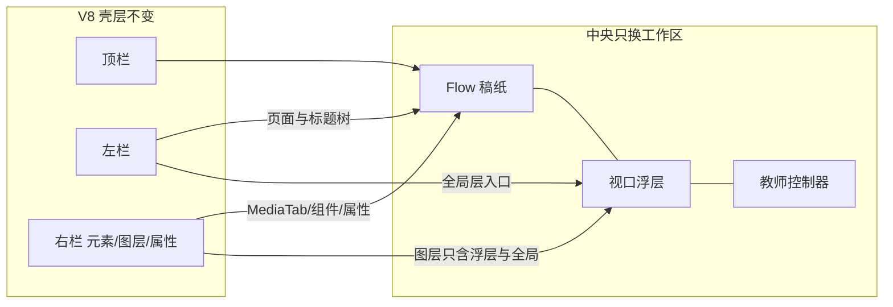
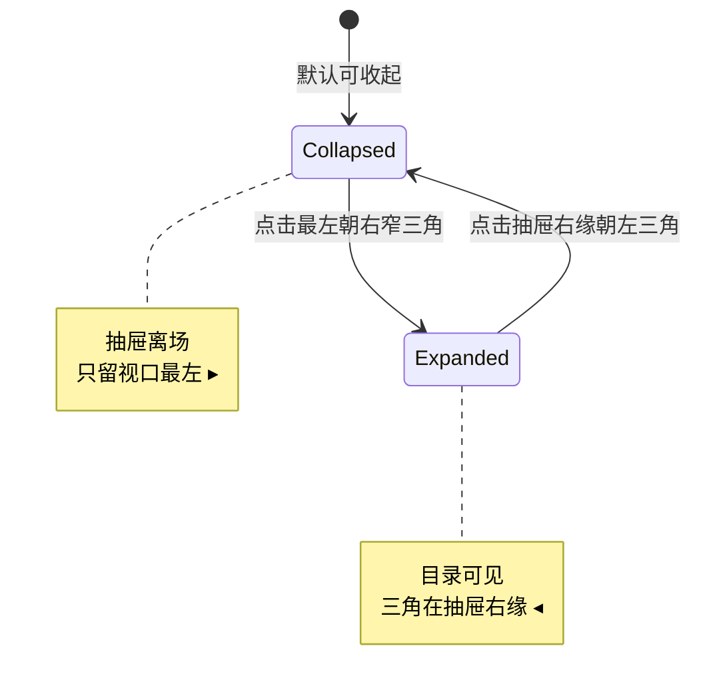
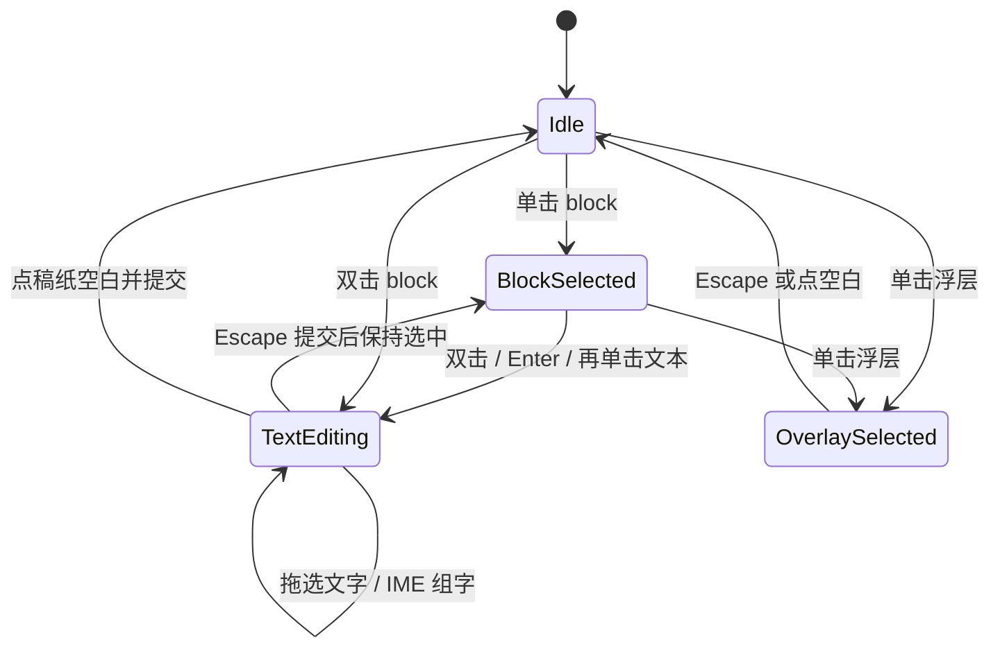
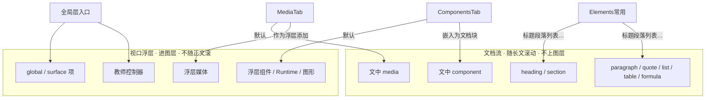

# R4 Flow 编辑/运行 UI 合同

> 冻结级别：**coordinator-proposed freeze**（2026-08-17）
> 依据：根计划 §0.4 第 4 点、§5.4 Flow、§5.7；`06_R4_FLOW_AUTHORING.md` §3；R0-G「后续阶段 Gate 由协调者裁决」；R2-GATE 已解锁本设计任务
> 教师逐图确认：**尚未发生**。不因此等待；符合 §5.4 即视为实现前合同
> 质量状态：`unverified`。不是 `art candidate`，不是 `accepted`。不宣称 V9 编辑器可用
> 实现：仍等 **R3-CUT + 本合同冻结**。R4-A/B/C/D/Z 不得把旧 PNG、弱化 `FlowElementsTab`/`FlowPropertiesTab` 或 `docs/tasks/v9-editor/artifacts/experience/flow-*.png` 当实现合同
> 本文只约束教师可见 UI 与交互。不改产品源码

参考可看、冲突以本文为准：

- `V9_EDITOR_UI_DESIGN_SPEC.md` §3、§4.1–4.2、§5.2、§6–8（壳层、树层级、运行态方案 1、无 `projectMode`）
- `V9_EDITOR_UI_FLOW_REFERENCE.png`（密度与运行态三角方向有用；图层行、整段文字属性、缺共享入口等 **作废**）

---

## 0. 一句话产品事实

Flow 是连续长文，不是 1280×720 幻灯片。教师在稿纸上直接点选 block、双击就地编辑，使用与成熟 V8 相同的选区级粗体/斜体/颜色/IME。课程树和图层只认「页面 / 可导航标题」和「真正的浮层」；普通段落既不上树，也不占 z-order 行。媒体、组件、属性、互动、全局层继续走成熟 V8 右栏，不另做一套 Flow 面板。

---

## 1. 与旧 FLOW 参考图冲突时以本文为准

下列条款覆盖 `V9_EDITOR_UI_FLOW_REFERENCE.png`、旧 `V9_EDITOR_UI_DESIGN_SPEC.md` 中被该图带偏的细节，以及当前供体里的弱化 Flow UI。实现、审阅、验收都按本表，不按图。

| # | 旧图 / 弱化 UI 的画法 | 本合同 |
|---|---|---|
| C1 | 右栏「图层」列出 H1、表格、H2 等正文 block | **禁止**。普通 heading/paragraph/quote/list/table/formula/文中媒体/code/callout/section/divider/文中 component **不得**成为通用 z-order 图层行 |
| C2 | 属性页把整段字体/字号/字重/颜色当成段落级字符串控件 | **禁止**。正文在稿纸里用 caret/选区编辑；粗体/斜体/颜色写 V8 `TextRun[]`（R1-A 已入 schema）。属性栏可改 **block 结构**（标题级别、列表有序、引用出处、媒体说明、表格题注），不得用单行输入框「改正文」替代就地编辑 |
| C3 | 右栏看起来像独立 Flow 属性/元素页 | 右栏必须是成熟 V8 页签：**元素、图层、属性**；专业模式另有 **组件、互动与动画、开发**。媒体库是 **元素内嵌 MediaTab**，不是顶级「媒体」页签，更不是 `FlowElementsTab` |
| C4 | 未标出点击 / 双击 / caret / 上下文工具位置 | 见 §7：单击选 block，双击（或已选后 Enter / 再点文本）进入就地编辑；选区工具条在 **当前 block 内顶部或正下方**，不靠图层双击改名 |
| C5 | 未区分文中媒体与浮层 | 见 §9。从 MediaTab 默认插入 **文中 media block**（随正文滚、不进图层）；显式「作为浮层添加」才进图层。组件/Runtime/图形默认浮层 |
| C6 | 课程树示例可被误解成「本页所有块」 | 树 = Flow **页面父节点** + **本页目录** 下的 heading/section。paragraph 等普通 block **不上树** |
| C7 | 编辑态稿纸底部画了一条常驻「教师控制台」像页面页脚 | 教师控制器是 **全局层视口浮层**，不是文档流的一块。有当前 location 可见性时叠在阅读区底部；进入「全局层」后可选、可改逐页显隐。动作集仍是：上一场景、下一场景、场景目录、重播、声音、全屏、收 |
| C8 | 未画「共享内容 → 全局层（全课）」与 V8 左栏的连续性 | 四态左栏固定该入口；进入只切换 authoring scope，不改课程树、不创建 location、不写 `projectMode` |
| C9 | 未画 Elements 常用如何给 Flow 插标题/段落 | 仍用同一个 `ElementsTab`。Flow 页作者范围下，「常用」插入 **文档 block**（标题/段落/列表/引用/表格/公式/分隔/提示/分节），不是 Slide 画布节点。禁止新建 `FlowElementsTab` / `FlowPropertiesTab` |
| C10 | 运行态只给了两个小插图，未写长文滚动与三角坐标 | 运行态目录采用已确认 **方案 1**（§12）：三角 `position: fixed` 贴视口，不随长文滚动离场 |
| C11 | 供体 `FlowPropertiesTab` 用整段 `text` patch；`FlowElementsTab` 自建 block 宫格 | **反模式**。R4 不得接线这两块作为产品表面 |
| C12 | 旧经验截图把 paragraph 画进图层并可双击改名 | **反模式**。改名只适用于课程树里的 **页面** 与 **heading/section**；改正文只在稿纸就地编辑 |

---

## 2. 沿用的成熟 V8 壳层（禁止另起炉灶）

产品表面永远是成熟 V8 `App`。Flow 只替换 **中央工作区** 和 **左栏课程树的信息架构**；顶栏、右栏页签、MediaTab 嵌套位置、专业/简洁模式不变。

```text
顶栏 TopToolbar
  新建 | 打开 | 最近 | 保存 | （专业：另存为、工程检查）
  撤销 Ctrl+Z | 重做 Ctrl+Y / Ctrl+Shift+Z
  当前位置试运行 | 导出 ▾
  工程标题 · 保存状态 | 简洁 / 专业

左栏 ScenePanel（纯 Flow 时标题改为「课程结构」，不是第二套 App）
  共享内容
    全局层（全课）     ← 固定入口，与页面树分隔
  课程结构
    [新增页面]         ← R4：只新增 Flow 页面；主按钮+下拉三类入口交给 R6
    页面…
      本页目录
        heading / section

中央 Workspace
  Flow 连续稿纸（阅读宽，可纵向滚动）
  不是 1280×720 裁切舞台
  无 Slide「场景状态」条
  浮层与教师控制器使用视口坐标，叠在稿纸之上

右栏 RightSidebar（页签壳不变）
  简洁：元素 | 图层 | 属性
  专业：元素 | 组件 | 图层 | 属性 | 互动与动画 | 开发
  元素 → 分类「常用 / 媒体 /（专业）控制与全局」
  「媒体」分类内嵌同一个 MediaTab（图片库、视频库、声音库）
```

禁止：

- 持久化 `projectMode` / `courseMode` / `editorMode`（简洁/专业是会话 UI，不是四态）
- 第二套 RightSidebar、第二套 MediaTab、Flow 专用组件库、Flow 专用通用属性系统
- 把 Flow 做成多张 1280×720 幻灯片
- 左栏再挂第二套「讲义大纲」
- 用占位卡片写「面板暂不可用」来代替共享入口

---

## 3. 图 A — 编辑态（教师审阅主图）

1366×768 密度。侧栏紧凑单行；中央稿纸可独立滚动。

```text
┌─────────────────────────────────────────────────────────────────────────────┐
│ 互动课件编辑器 │ 新建 打开 保存 │ 撤销 重做 │ 试运行 导出 │ 未命名 · 已保存 │简洁│专业│
├────────────┬──────────────────────────────────────────┬────────────────────┤
│ 共享内容   │ 稿纸（连续长文，纵向滚动）                  │ [元素] 图层 属性   │
│            │                                          │ 专业另见：组件 /    │
│ 🌐 全局层  │  工业化让城市生活变得更好吗？  ← heading   │ 互动与动画 / 开发  │
│   （全课） │                                          │                    │
│            │  导入的工厂记录显示……      ← paragraph    │ 元素 / 常用        │
│ ─────────  │  （普通段落：可点选，不上树、不进图层）     │  标题 段落 列表    │
│ 课程结构   │                                          │  引用 表格 公式    │
│ [+ 新增页面]│  ┌─ block 选中 / 编辑 ─────────────────┐ │  分隔 提示 分节    │
│            │  │ ① 单击左边空白：选中整块              │ │                    │
│ ▼ 导入     │  │ ② 双击文本：caret + 选区              │ │ 元素 / 媒体        │
│ ▼ 工业化与 │  │ ③ 上下文工具条：在块内顶或块正下方     │ │  ┌ MediaTab ─────┐ │
│   城市 ●   │  │    [B] [I] [U] [S] [•] [高亮] [A▾]   │ │  │ 图片库 视频库  │ │
│   本页目录 │  │ 阅读任务█                             │ │  │ 声音库 导入    │ │
│     H1 阅读│  └──────────────────────────────────────┘ │  └────────────────┘ │
│     H2 材料│                                          │                    │
│     A      │  ┌ 文中图片（media block）─────────────┐  │ 图层（本页有效浮层）│
│     H2 材料│  │ 随正文滚动 · 点选后改 alt/题注/宽度  │  │  ✦ 浮层图片        │
│     B      │  │ 不是图层行                           │  │  ✦ 互动组件        │
│     H2 证据│  └──────────────────────────────────────┘ │  🌐 教师控制器      │
│     H2 结论│                                          │  （无 paragraph 行）│
│ ▶ 课堂讨论 │  ✦ 浮层组件 ── 视口坐标、八向、进图层      │                    │
│            │                                          │ 属性                │
│            │  ╔════════════════════════════════════╗  │  标题级别 H1–H6    │
│            │  ║ 教师控制器（全局浮层，可隐）        ║  │  列表：有序/无序    │
│            │  ║ 上一 下一 目录 重播 声音 全屏 收    ║  │  选区：粗体/斜体/色 │
│            │  ╚════════════════════════════════════╝  │  禁止整段改正文框  │
├────────────┴──────────────────────────────────────────┴────────────────────┤
│ 已保存 · 流式页 2/3 · 选区: block「阅读任务」· 文本编辑中 · 缩放 100% · 字数 │
└─────────────────────────────────────────────────────────────────────────────┘
```

标注清单（实现与审阅必须能对上）：

| 编号 | 位置 | 教师可见行为 |
|---|---|---|
| A1 | 左栏最上方 | 「共享内容 → 全局层（全课）」。点击后稿纸仍预览当前 Flow 页，选择/属性/图层切到 global owner |
| A2 | 左栏课程树 | 只含 Flow 页面 + 该页 heading/section。当前页高亮。普通 paragraph **不出现** |
| A3 | 树节点双击 / F2 | 只重命名 **页面显示名** 或 **heading/section 标题文本**（与稿纸同一字段）。不能对 paragraph 做「图层改名」 |
| A4 | 稿纸 block | 整块可命中。单击 = 选中（描边/左边条）。双击 = 就地编辑 |
| A5 | 编辑中 | 可见 caret 与选区；IME 组字过程不提交、不丢字 |
| A6 | 上下文工具 | 只属于当前 block，出现在块内顶部或块正下方；滚动时跟随该块，不钉死在窗口顶 |
| A7 | 文中媒体 | 在文档流里，随长文滚动；选中后右栏属性可用；**图层列表没有这一行** |
| A8 | 浮层 | 叠在稿纸上，视口坐标，不随正文滚动；图层有行；可拖、可八向（与 V8 选择框同一视觉语言） |
| A9 | 右栏元素 | 同一 `ElementsTab` + 内嵌 `MediaTab`；专业 `ComponentsTab` |
| A10 | 右栏图层 | 空态文案：「本页没有浮层。标题和段落在稿纸里编辑，不出现在图层。」 |
| A11 | 底栏 | 当前 Flow 页、选区种类（文本 / block / 浮层 / 全局）、缩放、保存。无 Slide 状态条 |
| A12 | 顶栏撤销/重做 | 对文档结构、选区格式、浮层几何、全局显隐都有效；一次教师动作一次 history |



---

## 4. 图 B — 运行态 · 目录展开

试运行 / Published Player。目录是运行会话 UI，**不写入工程、history、导出 HTML**。

```text
视口（Player，非编辑器三栏）
┌──────────────┬──────────────────────────────────────────────┐
│ 目录         │  长文（可滚动）                                │
│ 工业化与城市 │                                              │
│  阅读任务    │  # 工业化让城市生活变得更好吗？                 │
│  材料 A      │  ……大量正文……                                 │
│  材料 B      │                                              │
│  证据归类    │  （展开不遮挡关键正文：抽屉占左栏固定宽，       │
│  结论        │   正文从抽屉右缘开始排，仍可完整滚动）          │
│              │                                              │
│            ◂ │  ← 三角按钮：贴在抽屉右缘，指向左 = 将收起     │
│              │    position:fixed；不随正文滚动               │
│              ├──────────────────────────────────────────────┤
│              │  教师控制器（视口底，可收起）                   │
└──────────────┴──────────────────────────────────────────────┘
```

规则：

- 目录项 = 当前课的 Flow 页面 + 该页 heading/section，与编辑态课程树同一层级，不含 paragraph
- 点击目录项滚动到稳定锚点（`heading`/`section` 的 block id），不改工程
- 三角在抽屉 **右缘中部**，chevron **朝左**
- 长文在右侧独立滚动；目录抽屉自身也可在条目很多时内部滚动
- 教师控制器动作集与 §2 相同；控制台内 **不得** 出现「试运行」

---

## 5. 图 C — 运行态 · 目录收起

```text
视口
┌─────────────────────────────────────────────────────────────┐
▸ 长文占满剩余宽度，可纵向滚动                                  │
│  （收起后抽屉完全离场，不留遮挡条、不留宽空白）                 │
│                                                             │
│  # 工业化让城市生活变得更好吗？                               │
│  ……                                                         │
│                                                             │
│  教师控制器（若未收）                                         │
└─────────────────────────────────────────────────────────────┘

▸ = 只留视口最左边一条窄三角，chevron 朝右 = 将展开
    高度约 48–64px，垂直居中或略偏上，不挡住正文首行阅读
    position:fixed；正文滚动时三角不动
```

方案 1（已确认，冻结）：

| 状态 | 抽屉 | 三角位置 | 三角朝向 | 正文 |
|---|---|---|---|---|
| 展开 | 在视口左侧占宽 | 抽屉右缘 | 朝左 | 从抽屉右侧开始，可滚 |
| 收起 | 完全离场 | 视口最左边缘 | 朝右 | 占满视口（除控制器） |

`tocOpen` 只存在于运行会话。保存、导出、打印/PDF/DOCX **都不含** 目录 DOM。



---

## 6. 课程树与图层准入（硬过滤）

### 6.1 课程树（左栏）

| 进入课程树 | 不进入课程树 |
|---|---|
| Flow 页面（父节点，教学名称） | paragraph |
| heading（本页目录子节点） | quote、list、list item |
| section（本页目录子节点） | table、formula、divider |
| | 文中 media、code、callout |
| | 文中 component |
| | 浮层、全局项、控制器（它们走「共享内容 / 图层」） |

- 页面与标题不得画成扁平同级列表
- 拖动页面：整页（含其目录）在课程顺序中移动
- 拖动标题：只在该页目录内排序，并反映为文档 heading 顺序
- 选择树节点：改 editor selection / active location，**不**写 history
- 进入全局层：**不重建、不改** 这棵树

V9 location 只给页面起点与 heading/section 锚点。R4-A 不得给普通 paragraph 写课程级 location。

### 6.2 图层（右栏「图层」= 现有 NodesTab）

| 进入通用 z-order 图层 | 不进入图层 |
|---|---|
| 当前页视口浮层（媒体/组件/Runtime/图形） | 所有普通文档 block，含 heading |
| `surfaceLayerItems` 适用于本页者 | 文中 media / 文中 component |
| `globalLayerItems` 适用于本页者（标来源「全局」） |  |
| 教师控制器（来源「全局」，不伪装成页面行） |  |

heading 可导航，但 **不是** z-order 图层。教师改标题文字：稿纸双击或树节点重命名，不在图层里改名。

锁定/隐藏/owner 内排序：只对真实浮层与全局/surface 项，语义与 R3 统一图层相同。文档 block 的前后关系用文档顺序/缩进命令，不用图层拖排。

---

## 7. 命中、双击、选区、上下文工具



### 7.1 指针

| 手势 | 结果 |
|---|---|
| 单击文档 block | 选中该 block（可多选：Ctrl/Shift 按 V8 多选习惯）。**还不进入** 文本编辑 |
| 双击文档 block 的文字 | 进入就地编辑，caret 落在点击处 |
| 已选 block 后按 Enter，或再单击其文本 | 与双击等价，进入就地编辑 |
| 在编辑中拖动 | 形成字符选区；工具条跟选区 |
| 单击浮层 | 选中浮层；结束文本编辑（先提交） |
| 拖浮层 / 八向 | 只改浮层几何；一次 pointerup 一次 history |
| 点稿纸空白 | 提交编辑，清空 block 选中；不误造空段落 |
| 点左栏标题 | 滚动到锚点并选中对应 heading block，不进文本编辑 |

### 7.2 上下文工具出现位置

**选区级字符格式**（沿用 V8 `TextEditOverlay` 能力，不减项）：

- 仅在 `TextEditing` 且目标是 heading / paragraph / quote / list item / table cell 时出现
- 位置：当前 block **内顶部**；若块顶会被滚动裁切，则改到块 **正下方**，仍属于该块，不改挂到窗口或右栏
- 控件：局部加粗、斜体、下划线、删除线、着重号、高亮、清除局部格式、文字颜色
- 指针点工具条不得抢焦导致选区丢失（与 V8 `onMouseDown preventDefault` 相同）

**block 结构工具**（`BlockSelected` 或编辑中均可）：

- 位置：选中描边的左上或块下方同一条上下文带
- 控件按类型：标题级别、列表有序/无序、缩进/取消缩进、上移/下移、转为标题/转为段落、删除
- **没有**「图层改名」入口

公式：双击打开与 V8 相同的公式编辑器，不走字符 runs。code 块：就地编辑代码字符串（R1 schema 无 runs）。

---

## 8. 共享右栏与全局层入口

全部是现有 V8 表面的 **同一实例**，按当前 Flow 选区适配内容。不得复制组件。

| 入口 | 教师从哪里进 | Flow 页作者范围下做什么 |
|---|---|---|
| 元素 → 常用 | 右栏「元素」 | 在 caret/选中块之后插入文档 block：标题、段落、列表、引用、表格、公式、分隔、提示、分节 |
| 元素 → 媒体 | 同一元素页内嵌 MediaTab | 导入/点选图片、视频、声音。默认 **插入文中 media block**。卡片菜单或 Alt 点击：「作为浮层添加」 |
| 元素 → 常用 图形 | 同一 ElementsTab | Flow schema 无 shape block → **作为页面浮层** 插入（进图层）。不是文档块 |
| 元素 → 控制与全局 | 专业 + 已进全局层 | 与 V8 相同：教师控制器、全局元素。未进全局层时提示先点左栏「全局层」 |
| 组件 | 专业「组件」 | 同一组件目录。默认插入 **页面浮层**；右键可「嵌入为文档块」（`FlowComponentBlock`，不进图层） |
| 图层 | 右栏「图层」 | 只列 §6.2 对象。来源标签：浮层 / surface / 全局 |
| 属性 | 右栏「属性」 | 见 §11。浮层几何、媒体替换、组件 props、全局逐 location 显隐都在这里 |
| 互动与动画 | 专业 | 对 **浮层** 保留 V8 简单出现动画与互动映射。文档 paragraph **不做** 画布入场动画 |
| 开发 | 专业 | Runtime 作为浮层插入；作者目标为当前 Flow location / 浮层 `authoringAddress` |
| 全局层 | 左栏共享内容 | 进入真实 global authoring scope；可选项、改属性、设本页隐藏/显示；退出回到页面作者范围 |

插入失败必须给教师可读原因（未选页、资产为空、组件不支持当前 scope），禁止空回调。

---

## 9. 所有权：文档 block vs 浮层



| | 文档 block | 页面/全局浮层 |
|---|---|---|
| 坐标 | 文档流 | 视口，映射到与 Slide overlay 相同的规范几何空间 |
| 滚动 | 跟正文 | 不跟正文；换页后按 location 显隐 |
| 图层 | 否 | 是 |
| 课程树 | 仅 heading/section | 否 |
| 选择框 | 块左边条/描边，无八向（表格除外：单元格边） | V8 八向 + 旋转（若该类型在 Slide 支持旋转） |
| Delete | 删块或删字符，见 §10 | 删图层项 |
| 保存 | Flow `blocks` | `surfaceLayerItems` / `globalLayerItems` |

右键互转（R4 必须可达，不是后续才有）：

- 文中媒体 → 「改为浮层」：移出文档流，成为本页 overlay，进图层
- 浮层媒体 → 「嵌入正文」：插入到当前 caret/块后，离开图层
- 组件同理（浮层 ↔ `FlowComponentBlock`）

一次互转一次 history。不得 silently 把文中图写进图层。

---

## 10. Undo/Redo、右键、Delete、键盘焦点

焦点只有三种。快捷键先问焦点，再问选区。

| 焦点 | 如何进入 | Delete / Backspace | 方向键 | Ctrl+Z / 顶栏撤销 | 右键 |
|---|---|---|---|---|---|
| **文本** | 就地编辑、IME、公式编辑、属性输入框、contenteditable | 只删字符/选区；**不**删 block、**不**删浮层 | 移动 caret | 先结束组字；撤销上一次已提交的文本/格式事务 | 复制/剪切/粘贴；字符格式；不出现「删除图层」 |
| **block** | 单击文档块且未进入编辑 | 删除选中 block（多选一次 history）；维护标题锚点与引用 | 移动到上/下一块 | 撤销结构命令 | 复制/剪切/粘贴/重复；缩进；转为标题/段落；改为浮层（媒体/组件）；删除 |
| **overlay** | 单击浮层或图层行 | 删除选中浮层（锁定则拒绝并说明） | 微移浮层（与 V8 nudge 相同） | 撤销几何或删除 | 与 V8 图层动作对齐：复制/删除/显隐/锁定；「嵌入正文」（媒体/组件） |

补充：

- `compositionstart` 期间：所有 Delete、撤销、切页、点图层 **不得** 打断 IME 或提前 commit
- 顶栏撤销在三种焦点都可用；文本编辑中的撤销不得跳过未提交草稿去删上一结构动作——提交边界与 V8 文字事务相同（blur / Enter 提交，Escape 取消未提交草稿）
- Ctrl+A：文本焦点 = 选当前块内全文；block/overlay 焦点 = 选本页同类对象（块多选或浮层多选），**不可**一次把全部 paragraph 当成图层全选
- 成熟 V8 画布目前 **没有** 自定义右键（R0-B）。Flow **必须有** 上表产品菜单；Shift+F10 / Menu 打开同一菜单。这不要求 R4 给 Slide 补右键
- 属性栏输入框视为文本焦点；Delete 不删当前图层
- 全局 scope 下，结构命令（插段落、删标题）必须拒绝，原因：「全局层选择不能改动 Flow 页面目录」

---

## 11. 选区级文字（不得退化成整段字符串属性）

硬要求来自根计划 §0.4.4 与 §5.4，以及 V8-TEXT-01：

1. caret、范围选区、IME 组字、中文输入后保存重开与 Player 字形一致
2. 选区级粗体 / 斜体 / 颜色（外加 V8 已有的下划线、删除线、着重、高亮）写在 R1-A 的 `text` + `runs?: TextRun[]` 上
3. 画布工具条与属性栏对 **同一选区** 写同一事务；禁止各写各的草稿
4. 属性栏 **不得** 提供「正文」单行/多行框作为主编辑手段去整体替换 `text`
5. 无选区时，属性里的粗体/斜体若显示，只表示「当前块默认样式预览」，点击应先要求选区或选中该块全文，而不是静默给整段打一种样式却丢掉已有 runs——最短充分：无选区点格式 = 选中该块全部字符再应用
6. heading / paragraph / quote / list item / table cell 使用 runs。callout `body` 与 `code` 在 schemaVersion 9 仍是整段字符串，R4 **不**借此升 V10；这两类就地编辑整段即可
7. 旧工程纯字符串 block 仍可打开；第一次局部格式才写 `runs`

段落/标题结构（级别、有序列表、引用出处、段前段后）可以是 block 级属性，这与「选区级字符格式」不是一回事。

---

## 12. 运行态目录与长文（方案 1 冻结）

- 默认：允许从收起态开始，避免小视口一进来就被抽屉压住正文
- 三角与抽屉均为视口坐标（`position: fixed`）
- 展开宽度约 240–280px，1366×768 下正文仍可阅读；不得用第二套全屏目录
- 键盘：三角可 Tab 聚焦；Esc 在展开时可收起（若焦点在目录内）
- `aria-label`：展开「收起目录」，收起「打开目录」
- 打印/PDF/DOCX：标题、正文、列表、表格、公式、媒体 fallback 走文档结构；目录抽屉不进文件（导出菜单本身归 R7）

---

## 13. 新建、新增、自动适配

- 不保存 `projectMode`。纯 Flow 由「所有被引用 surface 都是 flow」推导
- **新建工程**：顶栏新建菜单直接提供「空白流式讲义」（根计划 §5.1）。R4-Z 必须接到用户可见入口
- **工程内新增**：R4 左栏主按钮 = 新增 Flow 页面（原子：surface 最小块 + location + 选中 + 一次 history）。三类 surface 的「主按钮 + 下拉」是 **R6** 的合同，不在 R4 做完
- 空白页最小内容：一个可导航 H1（占位「无标题」）+ 一个空 paragraph。H1 出现在本页目录；空 paragraph 不上树、不进图层
- 不可删除工程最后一个 location
- 切页前先提交合法文本草稿；模态公式编辑未完成则阻止切页并说明原因

---

## 14. 仍可不阻断实现的缺口

教师尚未逐图签字。按 R0-G 与本任务授权，**没有必须先问教师才能写完本合同或让 R4-A 在 R3-CUT 后开工的缺口**。下列项已由协调者拍板；教师最终验收若反对，再改合同，不把它们写成「未定所以不能实现」：

| 项 | 协调者冻结 | 若教师后来反对 |
|---|---|---|
| 文中媒体默认、浮层需显式添加 | §8–§9 | 可改默认，但不允许「插入即进图层」却不告诉教师 |
| 组件默认浮层 | §8 | 可改默认嵌入正文 |
| 图形在 Flow 中当浮层 | schema 无 shape block | 不为此升 V10 |
| Flow 产品右键（Slide 暂无自定义右键） | §10 | 不可改成「完全没右键」 |
| 空白页 H1 + 空段落 | §13 | 可改文案，不可改成「只能靠导入才有页」 |
| 运行态默认收起目录 | §12 | 可改默认展开，三角几何仍按方案 1 |

Mixed 课程树、统一新增下拉、导出菜单入口不属于 R4 合同。

---

## 15. 给后续实现的边界（不是本任务实现）

- R4-A：page/block/heading 稳定 id 与 `authoringAddress`；selection 含 page、block、text range、authoring scope；普通 block vs overlay 分类；Delete 三焦点语义
- R4-B：单一 `FlowWorkspace` 文档编辑；复用 V8 选区格式桥；上下文工具；**不得** 新增 FlowElementsTab/FlowPropertiesTab
- R4-C：adapter 接到现有 MediaTab / Components / Properties / Nodes；不得复制这些文件
- R4-D：Player host + 方案 1 TOC；print/Docx helper
- R4-Z：才改 App/store/Workspace/ScenePanel/RightSidebar/TopToolbar
- 文字真相是 Course Project V9 Flow 字段 + `runs`，禁止不可保存的 UI 草稿第二真相

本文件冻结后，旧 PNG 只作历史参考。
