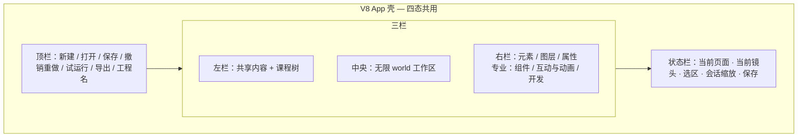
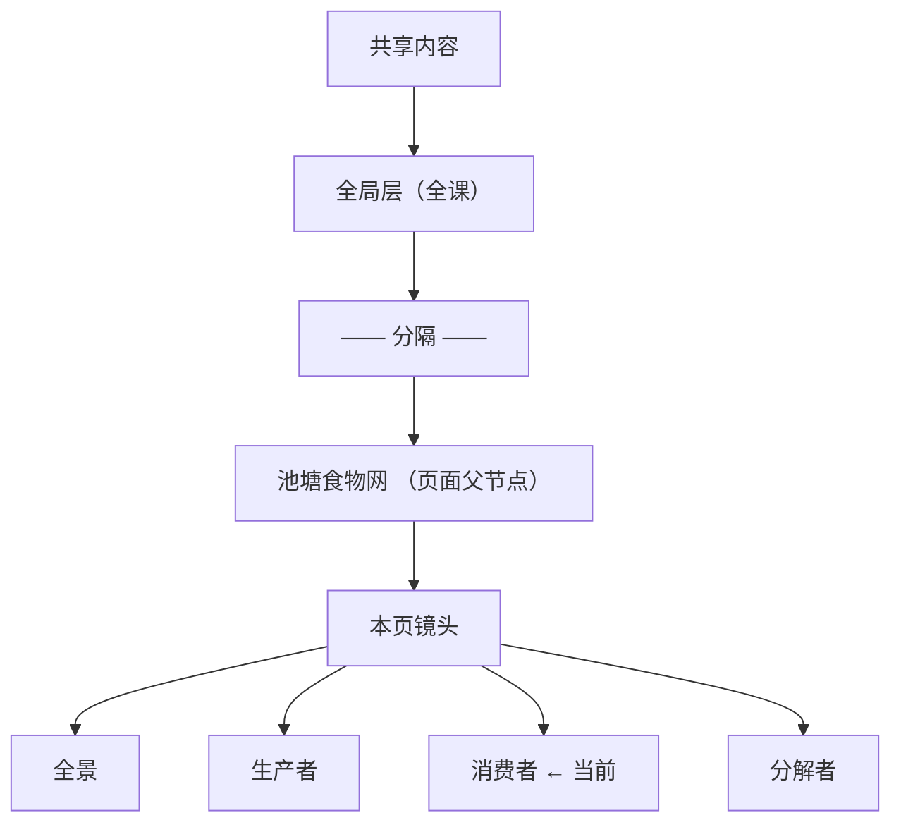
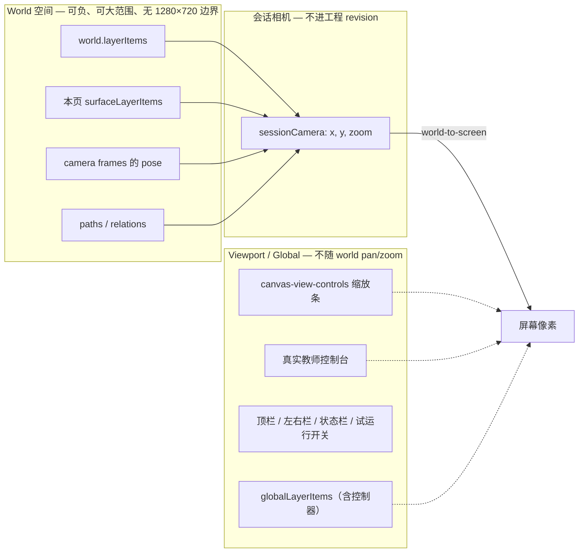
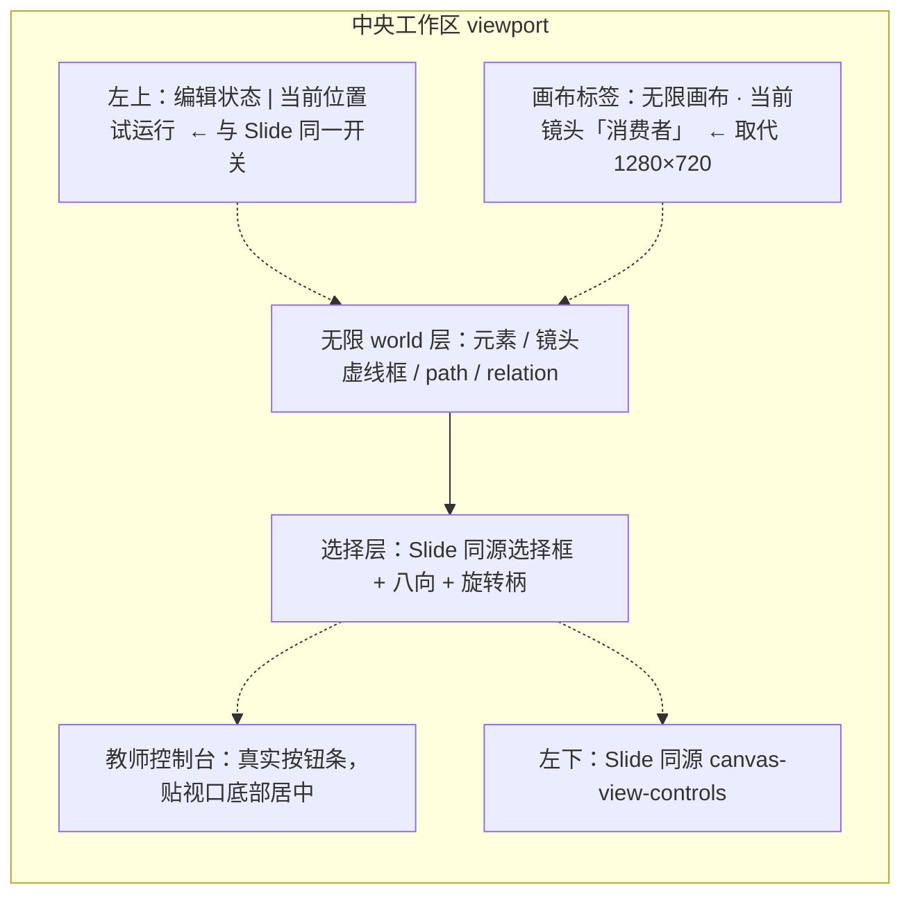
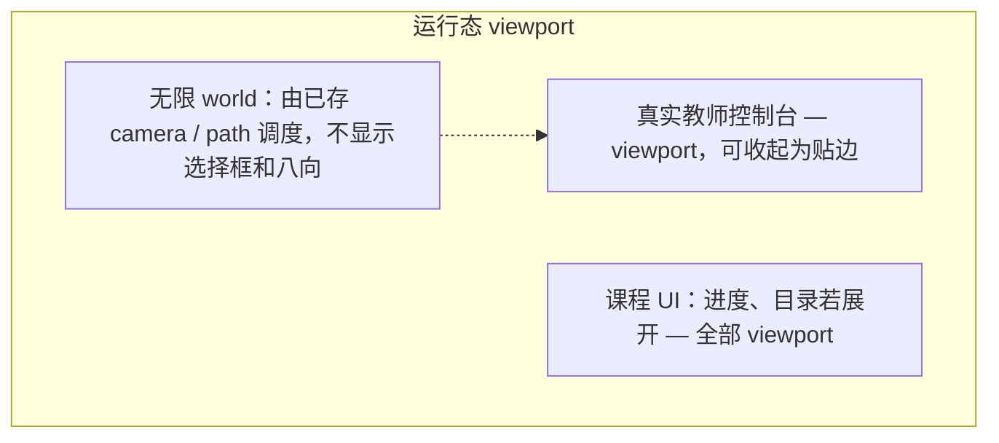
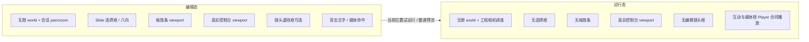
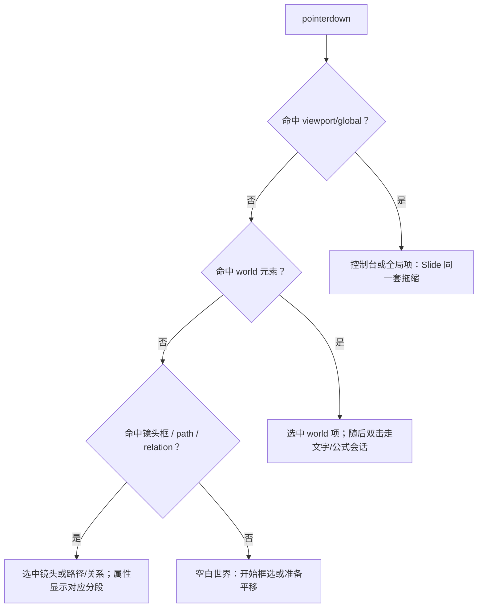

# R5 Spatial 编辑 / 运行 UI 合同

> 状态：**coordinator-proposed freeze**
> 日期：2026-08-17
> 任务：`R5-DESIGN`
> 计划包：`C:\Users\74755\Documents\HTML课件编辑器`
> 产品 worktree：`C:\Users\74755\Documents\HTML课件编辑器-v8-to-v9-rebuild`（本文未改其中任何源码）
> 依据：根计划 §0.4 第 4 点、§5.5；`07_R5_SPATIAL_AUTHORING.md` 第 3 节；`V9_EDITOR_UI_DESIGN_SPEC.md` 与 `V9_EDITOR_UI_SPATIAL_REFERENCE.png`（仅参考）；`handoffs/R2-GATE.md`、`handoffs/R2-B.md`、`handoffs/R2-C.md`
>
> 符合根计划 §5.5 的条款视为实现前合同。R5-A 及之后仍等 **R3-CUT + 本合同冻结**；未确认前不实现。
>
> **不是** `art candidate` / `accepted`。不宣称 V9 编辑器可用。

---

## 0. 本文效力

| 层级 | 文件 | 冲突时 |
|---|---|---|
| 1 | 根计划 `COURSEWARE_DEVELOPMENT_PLAN.md` §0.4-4、§5.5、§5.1–5.3、§5.6 | 最高 |
| 2 | **本文** | 覆盖旧 Spatial 参考图、弱化 Spatial UI、以及 `V9_EDITOR_UI_DESIGN_SPEC.md` §5.3 中与本文冲突的句子 |
| 3 | `V9_EDITOR_UI_DESIGN_SPEC.md` 共同壳层 / 左栏 IA（§3、§4） | 与本文一致的部分继续有效 |
| 4 | `V9_EDITOR_UI_SPATIAL_REFERENCE.png` | 只作密度与「页面—镜头树」方向参考 |
| 5 | 当前供体 `SpatialWorkspace.tsx` / `SpatialElementsPanel` / `SpatialCameraPanel` 顶替 Properties 的接线 | **反例**，不得当合同 |

Slide 已证明、Spatial 必须原样复用的合同以 R2-B 为准：对象、选择框、旋转柄、八向手柄共用同一 transform；`pointermove` 只预览，`pointerup` 一次 history；西/北 resize 移动原点；稳定 `authoringAddress`，不持久化 `hitId`。

---

## 1. 教师能看见什么（一句话）

Spatial 看起来仍是同一套 V8 编辑器：顶栏、左栏、右栏页签、缩放条、蓝色选择框、八向手柄、真实教师控制台都不换皮。中央不再有 1280×720 白页，而是一张可向负方向和大范围延伸的无限世界。多出来的只有「本页镜头」、镜头调度、以及按需出现的路径/关系，它们不能替代元素属性、媒体、组件或图层。

---

## 2. 与旧参考图 / 弱化 Spatial UI 冲突时以本文为准

实现时若对照 `V9_EDITOR_UI_SPATIAL_REFERENCE.png` 或当前 `SpatialWorkspace`，下列条款 **以本文为准**。

| # | 旧参考图或弱化 UI 的做法 | 本合同 |
|---|---|---|
| C1 | 画布左下角独立白底「− / 82% / + / 适配 / ⌂」空间缩放条 | **禁止**。必须使用与 Slide 同一套 `canvas-view-controls`（位置、尺寸、图标、百分比 `output`、适合窗口、抓手提示） |
| C2 | 画布右下角小地图作为默认 chrome | **不进合同**。R5 不实现小地图；需要时另立任务，且必须是 viewport overlay，不得成为第二套缩放控件 |
| C3 | 画布顶部「当前镜头 / 从当前画面更新 / 新建镜头 / 播放路径」常驻工具条 | **禁止**作为第二检查器。当前镜头名放在现有画布标签/状态栏；调度动作放在 **默认页面属性「镜头调度」** 与左栏「本页镜头」 |
| C4 | 粉色 / `#fef2f2` 矩形代替教师控制台 | **禁止**。必须是 V8 真实教师控制台（按钮：上一、下一、目录、重播、声音、全屏、收），viewport/global，不随 world pan/zoom |
| C5 | 世界元素用简化 SVG 色块，选择框带名称胶囊、白方块手柄 | **禁止**当合同。选择框/八向/旋转必须与 Slide `SelectionOverlay` 同源：描边 `#5b9cff`、锁定 `#f59e0b`、11×11 手柄白边、顶心旋转柄 |
| C6 | 右栏 Spatial 时用 `SpatialElementsPanel` 替换「元素」，用 `SpatialCameraPanel` 整页替换「属性」 | **禁止**。元素/媒体/图层/属性/组件/动画互动必须是 Slide 同一套页签；镜头与路径只作为 Properties **分段** 或渐进披露 |
| C7 | 双击文字弹出 textarea，无 IME/选区 runs | **禁止**。复用 Slide 文字/公式就地编辑（R2-C）：双击、IME、选区级粗体/斜体/颜色，画布与属性同一事务 |
| C8 | 把 1280×720 白页放大、或把 Slide 坐标 clamp 后假装无限 | **禁止**。无页面边界；world x/y 可负、可大范围，不得裁回 1280×720 |
| C9 | 左栏先做「镜头列表」工具头，或把 x/y/zoom、语义缩放、路径放进导航行 | **禁止**。左栏固定「共享内容 → 全局层（全课）」；分隔后才是页面父节点与「本页镜头」子树 |
| C10 | 图层里把 Camera / Relation 当成普通 z-order 行，或给 Spatial 另做一套彩色 owner 胶囊皮肤 | 来源标签保留（世界 / 页面共享 / 全局），行高与操作必须是 V8 紧凑 Nodes。镜头不是图层行；路径/关系不是通用图层 |
| C11 | 参考图中的彩虹虚线镜头框当作唯一视觉合同 | 镜头框是 **world overlay**（可有），但不得替代选择框，也不得做成粉色占位。激活/未激活用同一套强调色区分即可 |
| C12 | 参考图或旧 spec 写「选择柄使用屏幕坐标、与缩放控件同类」 | **部分作废**。选择框画在屏幕上，但几何必须由 **同一 world-to-screen** 从对象算出（R2-B）。viewport 项（控制台）不走 world 变换 |
| C13 | 新增 `projectMode` / 四模式开关 | **禁止**。纯 Spatial 由 locations/surfaces 推导 |
| C14 | 复制第二套 MediaTab / Components / Properties / Nodes / 控制器 | **禁止** |

---

## 3. 产品不变量（实现前硬约束）

1. 不新增持久化 `projectMode`、`courseMode`、`editorMode`。
2. 不复制弱化 Spatial 编辑器。文字、公式、图形、图片、视频、Component、Runtime、选择、图层、属性、媒体、动画、互动复用 R2/R3 的 Slide 内核。
3. Spatial **只增加**：无限 world 坐标、world-to-screen、会话 pan/zoom、camera frame、path、relation、semantic zoom、镜头运行调度。
4. 教师控制器属于 **global**；不是 world item，不伪装成 scene/world 行。
5. 选择、属性、图层指向同一 owner / `authoringAddress`。
6. 一次手势一次 history；`pointermove` 不写 revision。
7. 当前不出现可见 AI、引用复制、Patch、聊天。
8. 本文冻结 UI 合同，不授权改产品源码。

---

## 4. 共同壳层（与 Slide 同一套）

纯 Spatial 工程仍使用成熟 V8 App 壳，不卸载、不换列宽。



- 顶栏、左栏折叠、右栏页签壳与 Slide 相同。
- 中央 **没有** Slide 的「1280 × 720」画布标签，也没有场景状态条（那是 Slide scene/state）。Spatial 用「本页镜头」承担可导航位置。
- 底部状态栏仍显示：当前页面、当前镜头、选区、会话缩放百分比、保存状态。
- 「编辑状态 / 当前位置试运行」开关保留，位置与 Slide 相同（工作区左上）。

---

## 5. 左栏信息架构

### 5.1 固定顺序（纯 Spatial）

上 → 下，不可对调：

1. **共享内容**（分区标题，不是 location）
   - **全局层（全课）** — 课程级作者入口；点击不写 history、不创建镜头、不改变 active location
2. **分隔线**
3. **课程结构**
   - Spatial **页面**（父节点，教学名称，类型只用低干扰图标）
     - **本页镜头**（分组节点，不可当作一页）
       - camera frame 行：全景、生产者、消费者…（可导航 location）



### 5.2 左栏禁止出现

- 镜头的 x / y / zoom 数字
- semantic zoom 规则
- path / relation 名称或坐标
- 「世界图层」树（图层只在右栏 Nodes）
- 第二套「镜头列表」工具头叠在共享内容之上（参考图 C9）

### 5.3 交互

| 点击 | 结果 |
|---|---|
| 全局层 | 进入 global authoring scope；中央仍以 **当前 Spatial location** 为预览上下文；选区/属性/图层命令切到 global；**不**新建镜头 |
| 页面父节点 | 选中该页；若尚无激活镜头，激活首页镜头；属性显示页面 + 镜头调度 |
| 「本页镜头」分组 | 展开/折叠；不单独成为 location |
| 某个镜头行 | 将该 `spatial-camera` location 设为 active；会话相机飞到该 frame 的已存 pose（写 session，不写工程，除非教师再点「从当前画面更新」） |
| 镜头行 + / 重命名 / 删除 / 拖排 | 只在该页 camera frames 内；一次动作一次 history |

镜头的新建入口：**本页镜头旁的 +**，以及默认页面属性「镜头调度 → 从当前画面添加」。二者写同一命令，不在画布顶另做工具条。

纯 Spatial 的主按钮默认「新增无限画布页面」属 R6；本合同只要求：R5 范围内已有页面时，教师能在本页增加镜头，且旧镜头不消失。

---

## 6. 坐标空间（合同核心）

### 6.1 三套空间，禁止混算



| 对象 | 坐标空间 | pan/zoom 世界时 | 选择框几何 |
|---|---|---|---|
| 文字 / 图形 / 图片 / 视频 / Component / Runtime（world 或本页共享） | world | 跟着动 | 对象 frame → 同一 sessionCamera → screen；与 R2-B `stageSelectionOverlayGeometry` 同类 |
| camera frame 虚线框、path 折线、relation 连线 | world | 跟着动 | 不是元素选择框；命中可选中对应镜头/关系，但不出现八向缩放世界的「假页面」 |
| 教师控制台 | viewport/global | **不动** | 与 Slide 相同的八向/选择框，pointer delta 相对 **stage viewport**，禁止用自身边框或 world zoom 反缩放修补 |
| 其它 global Native/Component/Runtime | viewport/global | **不动** | 同上；它们是 HUD/课程级叠加，不是贴在世界上的地图元素 |
| 缩放条、侧栏、顶栏、状态栏 | viewport chrome | **不动** | 不可选为课件元素 |

### 6.2 无限 world 的教师可见规则

- 中央是工作区底（V8 深色舞台），**不画**固定白页、不画 1280×720 外发光卡片、不写「1280 × 720」。
- 点阵/网格（若做）只是视觉锚点，**不是**边界，必须铺满当前视口并随 pan 无限延续。
- 元素可以放在 `x < 0`、`y < 0`，也可以远离原点数千单位。保存、重开、Player 不得裁回 1280×720。
- 新建 Spatial 默认 `world.bounds.mode = infinite`。Schema 里的 finite bounds **不作为 R5 作者 UI**；不得用 finite 矩形冒充无限画布。
- 默认插入位置：当前会话相机中心附近，沿用 V8 连续插入错开（世界单位，不是「页内 20px 但 clamp 到页」）。

### 6.3 禁止的伪无限

```text
错误：Slide 1280×720 画布 + 把 zoom 范围加大 + 允许把元素拖出白页一点点
正确：没有页面矩形；sessionCamera 就是观察无限 world 的窗口；
      缩放条改的是 sessionCamera.zoom，不是给一张固定页做 CSS scale
```

Slide：世界 = 页面 1280×720，再外加舞台 zoom/pan。  
Spatial：世界 = 无界；**会话相机本身就是视图**。不得叠「页面 zoom × 相机 zoom」两套缩放。

### 6.4 变换公式（实现约束，供 R5-A/B）

对 world 项：

```text
screen = worldToScreen(worldFrame, sessionCamera, stageViewport)
选择框 / 八向 / 旋转柄 = 与对象同一 screen 投影
pointer 的 CSS 位移 / sessionCamera.zoom = world 位移
```

对 viewport/global 项：

```text
screen = viewportFrame（不乘 sessionCamera）
pointer CSS 位移 = viewport 位移
禁止：viewportDelta / worldZoom  或  inverse-scale 修补控制台
```

缩放只改变视图。控制台在 world zoom=0.5 或 2 时，屏幕上的像素尺寸与可点区域保持作者设定的 viewport 几何。

---

## 7. 编辑态中央工作区（高保真）

### 7.1 布局



教师编辑态应看到：

1. **无白页** 的深色无限舞台；内容可伸出当前窗口。
2. 世界元素以 **完整 Native/Component/Runtime 外观** 绘制（与 Slide 同一渲染内核），不是圆角色块示意图。
3. 选中世界元素时：蓝色选择框 + 八向 + 顶心旋转柄，视觉与 Slide 无法区分。
4. 左下 **同一套** 缩放条：缩小、百分比、放大、适合窗口、抓手提示；Ctrl+滚轮；空格/中键平移。这些控件是 viewport，不跟着世界跑。
5. 底部 **真实教师控制台**（不是粉框）：上一 / 下一 / 目录 / 重播 / 声音 / 全屏 / 收。进度文案在纯 Spatial 下为「当前镜头序号 / 总数 · 镜头名」。控制台不随 pan/zoom 移动。
6. 可选：未激活镜头的 world 虚线框 + 名称（world overlay）。激活镜头框强调。这 **不是** 选择框，也 **不是** 控制器。

### 7.2 缩放条绑定（与 Slide 同皮、不同数据）

| 控件 | Slide | Spatial |
|---|---|---|
| − / + / 百分比 | `view.zoom`（舞台对 1280×720 页） | `sessionCamera.zoom`（观察无限 world） |
| 适合窗口 | 重置页的 zoom/pan | 将会话相机设为 **首页镜头 pose**（与「重置到已存首页」一致）。适配全部内容 AABB 放在页面属性「镜头调度 → 适配全部内容」，不新增画布按钮 |
| 抓手 | 空格/中键拖 **页** | 空格/中键拖 **世界**（改 sessionCamera.x/y） |
| 百分比显示 | 舞台缩放 | 会话相机缩放 |

会话 pan/zoom **不写工程**。只有「从当前画面更新镜头 / 从当前画面添加 / 设为首页镜头」才把 pose 写入 `camera.frames` / `camera.home`。

### 7.3 选择、拖缩、命中（复用 R2-B）

- 单击：单选；Shift/Ctrl：加选；拖空白：框选 world 项（框选矩形在 viewport，命中判定在 world）。
- 对象、选择框、八向、旋转柄共用同一 world-to-screen。
- `pointermove` 只预览；`pointerup` 一次 `transform` history。
- 西/北手柄移动原点；锁定项可看不可改。
- 图片 / 视频 / Component / Runtime **必须可命中**；命中后右栏属性可改，不得停在「已导入但不能选」。
- viewport 项与 world 项重叠时：**先命中 viewport/global**（控制台在上），避免拖世界时误抓控制台，也避免选控制台时穿透到世界。
- 禁止第二套 Pointer 与 DoubleClick 互相抢事件（根计划 §5.5）。

### 7.4 文字、公式、选区格式（不得退化）

与 Slide / R2-C 同一合同：

- 画布 **双击** 进入就地编辑（caret、IME、选区）。
- 不得用 Spatial textarea 或「图层双击改名」代替正文编辑。
- 属性面板「编辑局部文字格式」与画布选区写入 **同一** `text` / `runs`（或公式 `ast`）。
- 空选区不整段套格式。
- 竖排、自适应宽高字段保留。
- 文字编辑中 Delete 不删图层。

### 7.5 媒体、组件、动画（不得退化）

- **元素**页签 = 现有 `ElementsTab`（含内嵌媒体入口）；**不是** `SpatialElementsPanel`。
- **MediaTab** 声音库/媒体库完整保留；导入后能加入 **当前 world**、命中、选中、替换、裁剪/适配、改属性。
- **组件**页签 = 现有 `ComponentsTab`；插入到 world，可命中、改 props/variant/preset。
- **图层** = 现有 `NodesTab` 紧凑行：来源、名称、显隐、锁定、拖排、复制、删除。
- **属性** = 现有 `PropertiesTab`：几何、填充、文字、媒体、组件、出现动画。
- **互动与动画** = 现有专业 `AutomationTab` / 简单出现动画。Spatial 不删减这些入口。

图层来源：

| 来源标签 | 谁 | 坐标 |
|---|---|---|
| 世界 | `world.layerItems` | world |
| 页面 | `surfaceLayerItems`（本 Spatial 页共享） | world（各镜头共用这份世界叠加） |
| 全局 | `globalLayerItems` | viewport |

路径、关系、镜头 **不出现** 在 Nodes 的 z-order 列表。

---

## 8. 默认页面属性中的镜头调度

当选区为空、或选中页面父节点、或选中「本页镜头」分组时，**属性页签**显示页面属性，其中必须有 **镜头调度** 分段。这是镜头的主作者入口，不是独立 Spatial 检查器。

### 8.1 页面属性结构（渐进披露）

```text
属性
├─ 页面
│    名称
│    （不出现 1280×720 画布尺寸）
├─ 镜头调度          ← 默认展开
│    当前会话画面（只读提示：平移缩放未写入课程）
│    首页镜头
│    从当前画面更新首页
│    镜头顺序（与左栏本页镜头同一份数据）
│    从当前画面添加镜头
│    选中某镜头时：重命名 / 更新为此画面 / 设为首页 / 删除
│    适配全部内容（把会话相机放到能看见全部 world 项的 pose，仍是会话，需再「更新镜头」才保存）
│    播放路径（选用一条 path；空 = 按镜头顺序）
├─ 语义缩放          ← 默认折叠
│    规则列表：图层 + 最小/最大缩放 + 可见
├─ 路径与关系        ← 默认折叠；见 §9
└─ （无选区时不显示元素几何）
```

选中某个 **镜头行** 时：属性以该镜头为主（名称、pose 只读摘要、从当前画面更新、设为首页），页面级调度仍可在同一页签向下滚动看到，不得换成另一个 App。

`SpatialCameraPanel` 允许作为 Properties 内部的这一分段实现，**禁止**在 Spatial 下把整个属性页签换成「只有镜头、没有元素属性」。

### 8.2 工程数据 vs 会话

| 数据 | 存哪 | 教师手感 |
|---|---|---|
| `camera.home`、`camera.frames[]` | 工程 | 镜头调度、左栏本页镜头 |
| `sessionCamera`、临时 pan/zoom | 会话 | 缩放条、拖动画布 |
| 播放路径选用、path/relation | 工程 | §9 |
| semantic zoom 规则 | 工程 | 页面属性折叠段 |

---

## 9. Path / relation：轻量专用，不替代 Properties

### 9.1 出现位置（渐进披露）

1. **默认隐藏**。普通选中一个文本/图片时，属性页就是 Slide 那套元素属性，顶部不出现路径编辑器。
2. **页面属性 →「路径与关系」折叠段**：列表、新建路径、新建关系。
3. **画布上点中** 一条 relation 线或 path 折线：属性页增加轻量分段（名称、端点、箭头类型、线型），**同时仍可**看到若误选元素时的元素属性切换——选中的是关系就只显示关系字段，不要整页变成 SpatialPathEditor 而丢掉页签。
4. **专业模式** 可将 `SpatialPathEditor` 作为属性页底部折叠卡。简洁模式只保留折叠段。

### 9.2 画布表达

- relation：world 空间连线（line / arrow / bidirectional）+ 可选标签。命中线选中关系。
- path：按 `layerItemIds` 顺序的 world 折线/曲线示意。命中线选中路径。
- 它们不是图层行；删除世界元素时引用必须清理或给出阻止原因（实现属 R5-C，UI 需显示人话原因）。

### 9.3 不做

- 不把 path 做成左栏节点。
- 不把 relation 做成 Nodes 里的「关系线」假图层（参考图 C10）。
- 不做 Focusky 级时间线（根计划 §15.1）。
- 不在导航栏展示路径坐标。

---

## 10. 全局层与教师控制台

### 10.1 进入全局层

- 左栏「全局层（全课）」始终可见。
- 进入后：世界仍作为 **预览上下文**（可继续 pan/zoom 观看），但选区默认在 global；在世界空白处点选仍可选 world 项并退出? **否** — 点 world 项应选中该 world 项并 **退出 global scope 回到页面作者范围**（与 Slide「点画布元素离开全局层」同类）。点空白不改变 location。
- 控制台始终可在全局层内选中、拖缩、改属性。
- 逐 location 显隐：当前 Spatial 镜头作为 location；隐藏后该镜头预览/播放不出现该全局项。

### 10.2 教师控制台合同（§5.6 + Spatial）

动作集不变：上一、下一、目录、重播、声音、全屏、收。

纯 Spatial 语义：

| 按钮 | 行为 |
|---|---|
| 上一 / 下一 | 本页 camera frames 顺序（与左栏一致）；到端点给出已在边界的状态，不跳到别的工程 |
| 目录 | 列出本页镜头（R6 Mixed 再扩成跨 surface 课程目录） |
| 重播 | 重放当前 location / 当前镜头，不写工程 |
| 声音 / 全屏 / 收 | 与 Slide 相同；收起是 **会话** 状态 |

几何：作者、选择框、八向、试运行、Published Player **同一规范几何**。控制台在 Spatial 中是 viewport 项，world zoom 变化时屏幕尺寸不变。

---

## 11. 运行态（试运行 / Player）

### 11.1 教师看到的运行画面



- **没有** 编辑缩放条、没有八向、没有镜头虚线编辑框（除非未来「检查态」另开，R5 不做）。
- 世界按首页镜头开始，上一/下一走镜头顺序或所选播放路径；相机动画 **不回写** 工程。
- 控制台仍是真实按钮，不是粉框；收起后只留会话态三角/条，与作者配置的「允许折叠」一致。
- global / 控制器 / 声音 / 课程 UI 不随镜头 pan/zoom。
- 当前 location 的逐项显隐生效。
- 离开再进入该页不得泄漏上一次编辑会话的 pan/zoom；运行相机只读工程数据。

### 11.2 试运行入口

与 Slide 相同：「当前位置试运行」覆盖中央工作区；顶栏「试运行/整课预览」走 Player。Spatial 试运行必须走真实 Spatial surface host，不得用 Slide 1280×720 页冒充。

---

## 12. 右栏页签合同（禁止换皮）

| 页签 | 简洁 | 专业 | Spatial 时 |
|---|---|---|---|
| 元素 | 有（含媒体子页） | 有 | **同一** `ElementsTab` / MediaTab |
| 图层 | 有 | 有 | **同一** `NodesTab` |
| 属性 | 有 | 有 | **同一** `PropertiesTab` + §8–§9 分段 |
| 组件 | 无 | 有 | 同一 `ComponentsTab` |
| 互动与动画 | 无（简洁属性仍有出现动画） | 有 | 同一 Automation |
| 开发 | 无 | 有 | 同一 Runtime 入口 |

禁止：`spatialDocumentControl && activeTab !== 'layers'` 时改渲染 `SpatialElementsPanel` / 整页 `SpatialCameraPanel`（当前供体 RightSidebar 反例）。

---

## 13. 编辑态 vs 运行态对照



---

## 14. 指针与双击路径（不得冲突）



双击只在已命中可编辑文字/公式的 world（或 viewport 文本）项上进入编辑。镜头框、path、空白双击不进入 textarea。

---

## 15. 与 Slide 复用清单 / Spatial 独有清单

**必须复用（同一组件与视觉合同）：**

- App / TopToolbar / RightSidebar 页签壳
- `canvas-view-controls` 缩放条
- 选择框、八向、旋转柄（SelectionOverlay / R2-B overlay 几何）
- ElementsTab、MediaTab、NodesTab、PropertiesTab、ComponentsTab、AutomationTab
- 真实教师控制台及 Properties 中的控制器字段
- 文字双击、IME、选区格式
- 连续插入错开、锁定/隐藏/复制/Delete、Undo/Redo

**仅 Spatial 增加：**

- 无限 world 与 sessionCamera
- 左栏「本页镜头」
- 页面属性「镜头调度」「语义缩放」「路径与关系」
- world 中的镜头框 / path / relation 叠加
- 运行态按 frame/path 调度相机

**明确删除/禁用的反例：**

- `SpatialWorkspace` 独立缩放条、minimap、粉框控制器、textarea 文字
- `SpatialElementsPanel` 作为元素页
- 用有限 Slide 页冒充无限画布

---

## 16. 协调者已拍板（原「教师拍板缺口」）

2026-08-17 协调者按 R0-G 授权采纳建议默认。教师最终验收若否决再改合同；**不阻断** R3-CUT 之后领取 R5-A。

| ID | 决定 |
|---|---|
| G1 | 编辑态默认显示全部镜头虚线框；未激活弱线，激活强调；属性中可关「显示镜头框」 |
| G2 | 「适合窗口」= 回首页镜头；内容 AABB 适配放在镜头调度里，不占用缩放条主按钮 |
| G3 | 非控制器的 global 图文是 viewport HUD，不随 world pan/zoom。**控制器一定是 viewport** |
| G4 | R5 不做小地图；仅当教师明确要求时另开任务 |

G3 若与教师直觉冲突，以教师最终验收为准，但不得把控制器改成 world 空间。

---

## 17. R5 实现边界（本文不授权开工）

| 任务 | 允许做的 UI 结果 | 仍禁止 |
|---|---|---|
| R5-A | world/camera 命令与会话相机 | 改 App/Workspace；画弱化画布 |
| R5-B | world-to-screen 接 R2 选择/双击 | 新 Properties/Media 面板 |
| R5-C | path/relation/semantic zoom + Properties **分段** | `SpatialLayerInspector`；用路径面板顶替元素属性 |
| R5-D | Player host；viewport 控制台 | 粉框控制器 |
| R5-Z | 接到现有壳；左栏本页镜头；缩放条复用 | 第二套 UI；`projectMode` |

R5-A `READY` 条件：R3-CUT 完成 **且** 本合同冻结（教师确认或协调者按 §5.5 维持 freeze）。

---

## 18. 验收口径（供日后 R5-Z / R8，不是现在跑）

根计划最终场景 12、14 的 UI 含义：

1. 从空白无限画布进入，无 1280×720 白页。
2. 插入文字/图片/组件，双击文字，选区格式，媒体命中后改属性。
3. 缩放条、选择框、八向、控制台与隔壁 Slide 页无法从样式上区分；控制台不随世界移动。
4. 左栏只有共享内容→全局层，分隔后页面→本页镜头；坐标不在树上。
5. 页面属性能调度镜头；路径/关系在折叠段，不替换属性页。
6. 保存重开、试运行、Player 相机与控制台一致。

自动化最多证明 engineering candidate。本文 **不** 把任何实现标为完成。
